# Production Transformer Workflow Implementation Plan

> **For agentic workers:** REQUIRED SUB-SKILL: Use `superpowers:subagent-driven-development` (recommended) or `superpowers:executing-plans` to implement this plan task-by-task. Steps use checkbox (`- [ ]`) syntax for tracking.

**Goal:** Implement a restart-safe, evidence-bound production Transformer that executes one exact Angular major at a time from the approved first-stage plan, derives every later exact stage from the preceding sealed output, and declares completion only after every stage and the final validation are proven.

**Architecture:** SQLite records and `StateTransitionService` own workflow truth. A separate Transformer worker runs a small LangGraph to quiescent boundaries; graph state contains identifiers and routing pointers only. Deterministic services prepare/fingerprint workspaces, preflight compatibility, authorize commands, verify versions, validate results, apply approved repairs, and seal stages. `CommandExecutorService` is the only workflow subprocess entry point. Azure OpenAI is advisory for prompt explanation and governed for repair proposal/review.

**Tech Stack:** Python 3.11+, FastAPI, SQLAlchemy 2, Alembic, SQLite WAL, LangGraph 0.6.x, Pydantic v2, existing standard-library Azure transport, Next.js/React/TypeScript/Vitest, npm/Angular CLI on Windows.

## Global Constraints

- Apply this plan against repository commit `e351d05faf4e87d5d4dfba923f0f9c86c3bedb37` or re-audit every referenced symbol that changed.
- Read root `AGENT.md` before implementation. Its authority rules are mandatory.
- Do not rerun full Analysis and Planning between Angular majors.
- Preserve the current Planner and Planning Reviewer. The only required Planning-side production change is atomic creation of the Transformer continuation after accepted G06. The shared command catalogue may receive a backward-compatible local-CLI verification template, but plan-generation semantics must not change.
- Never mutate the external source. Mutate only the active stage workspace.
- Never hold a database transaction open across filesystem copying, a subprocess, an Azure OpenAI call, or a human wait.
- Keep `--force`, `--allow-dirty`, `--legacy-peer-deps`, manual lockfile editing, shell execution, and a global `ng` executable forbidden.
- Do not use Codex at runtime. Use the existing Azure OpenAI gateway, registered roles, registered prompts, strict schemas, redaction, invocation evidence, and cost records.
- Do not describe a missing Transformer feature as a Planner defect.
- A command exit code of zero is necessary but never sufficient proof of success.
- Every mutation must have a validated input fingerprint and an explicit reconstruction source.
- Implement the smallest complete vertical behavior at each phase; do not add factories, interfaces, or queues without more than one current implementation.

---

## 1. Executive Verdict

### Verdict

**[PROVEN CODE TRUTH] The production Transformer path is not runnable or restart-safe today.**

- G06 approval ends in `WAITING_STAGE_PREPARATION`.
- No production caller automatically creates a durable transformation continuation.
- The stage-start API is not called by the frontend.
- If the stage-start API is called manually, it prepares the workspace and persists the bootstrap command as `queued`.
- That service never calls `CommandExecutorService.dispatch_execution`.
- The API startup path does not reclaim generic queued/running stage commands.
- The current process-local dispatch claim can strand a queued row after a crash.
- The current worker has stdout/stderr pipes but no stdin or terminal. It cannot answer a CLI question.
- Current cancellation cannot cancel a `queued` command and loses its in-memory signal across restart.

**[PROVEN CODE TRUTH] The Planning boundary is broadly correct and should be retained.**

- `MigrationPlan` contains the full 18→19→20→21 route and `stage_plan_strategy="resolve_exact_before_each_stage"`.
- `StageExecutionPlanService` materializes the first exact stage only.
- The approved exact stage contains bootstrap, one-major update, target inspection, final install, build, and test command groups.
- Existing Planner tests explicitly protect this Analysis/Planning-to-Transformer boundary.

**[RECOMMENDATION] Implement Transformer as a new durable continuation and worker, not as an expansion of Planning.** Make one minimal backward-compatible edit to the G06 application transaction so an accepted approval and its continuation cannot be separated by a crash.

**[RECOMMENDATION] An unexpected CLI process must be terminated and reconstructed from a safe stage input.** Do not expose “resume process” language in the API or UI. Current pipes cannot accept an answer, LangGraph resume re-runs a node, Windows console signals do not cover every descendant, and the CLI may already have partially mutated the workspace.

### Confidence

| Conclusion | Confidence | Basis |
|---|---:|---|
| G06 does not start Transformer work | 0.99 | Direct route/service/frontend trace |
| Manual stage start queues the first command | 0.99 | Service code and passing test assertion |
| Manual stage start does not dispatch it | 0.99 | No dispatch call; generic route shows the missing call |
| Generic stage command is not recovered after restart | 0.97 | Startup and recovery search; no eligible reconciler |
| Live unexpected-prompt pause/resume is unsafe | 0.96 | Worker I/O shape, mutation boundary, LangGraph and Windows semantics |
| Proposed file/schema design is the smallest safe production design | 0.86 | Repository patterns, frozen contracts, and failure analysis |

### Verification performed during this audit

**[PROVEN CODE TRUTH]** The focused suite passed without code changes:

```text
41 passed in 1.64s
```

Command:

```powershell
cd backend
.\.venv\Scripts\python.exe -m pytest tests/test_stage_execution_application_service.py tests/test_planning_transformation_boundary.py tests/test_command_executor_services.py -q
```

The passing stage-start test asserts that `COMMAND_QUEUED` is the last event and that the execution remains `queued`; it does not assert `COMMAND_STARTED`.

---

## 2. Truth Classification and Reference-Run Findings

Use these labels throughout implementation and review:

- **[PROVEN CODE TRUTH]** Directly established by production code, database models, routes, or passing tests.
- **[ARTIFACT TRUTH]** Established by immutable artifacts from `run-7e681dd42338`; it does not prove that corresponding production state exists in SQLite.
- **[INFERENCE]** A conclusion from code/artifacts/platform behavior that still needs a targeted runtime proof.
- **[RECOMMENDATION]** The implementation decision this plan requires.

### Reference-run artifact truth

Planning root:

```text
C:\Users\abdelilah.mortaki\Desktop\angularRus\angular-crud-poc-angular-21-a89b66ec7fca\.migration-factory\runs\run-7e681dd42338\artifacts\03_planning
```

| Fact | Evidence |
|---|---|
| **[ARTIFACT TRUTH]** Full route is 18→19, 19→20, 20→21 | `03_planning/migration-plan.json`, route IDs |
| **[ARTIFACT TRUTH]** Migration plan checksum | `sha256:1e6b186a813c733a3082ad644b74603e4bd5ca704699c5c16e7c0f111386cb00` |
| **[ARTIFACT TRUTH]** Stage strategy | `resolve_exact_before_each_stage` |
| **[ARTIFACT TRUTH]** Exact first stage | `artifacts/stages/angular-18-to-19--1c314baab9d61252/stage-execution-plan.json` |
| **[ARTIFACT TRUTH]** First-stage checksum | `sha256:2c3caffb6e8b2754b4b19d435fbbf27d3cf84b98798cd5b29451f13a9f094677` |
| **[ARTIFACT TRUTH]** First target | Angular/CLI `19.0.0` |
| **[ARTIFACT TRUTH]** Approved input workspace fingerprint | `sha256:75ab63d61351f338630dc9a1a818b048427698f0029074368bf1e8ceed4a1ef7` |
| **[ARTIFACT TRUTH]** Planning evidence-set checksum | `sha256:4921e437fc32cf56116e57e98052cc865292b3ae18a4bf084838fd7352393bda` |
| **[ARTIFACT TRUTH]** Planning Reviewer decision | `accept`, confidence `high` |
| **[ARTIFACT TRUTH]** G06 package workspace binding | `workspace_fingerprint: null` inside the nested package |
| **[ARTIFACT TRUTH]** Recovery policy | Reconstruct mutating steps; safe boundaries before bootstrap and after target verification |

Important distinctions:

- **[ARTIFACT TRUTH]** The `g06-package.json` file is an evidence package, not a persisted G06 human decision. It contains no authoritative approved status/actor/decision record.
- **[ARTIFACT TRUTH]** The prepared mutable stage workspace does not exist at G06 time and therefore is not fingerprint-bound by that package.
- **[ARTIFACT TRUTH]** The first exact stage plan is outside `03_planning`, under `artifacts/stages/...`; consumers must retrieve it by registered artifact ID/metadata, not assume it is in the planning folder.
- **[ARTIFACT TRUTH]** The Reviewer already calls out lockfile/package-manager constraints, third-party compatibility, environment requirements, custom schematics, and per-stage snapshots as unresolved. Transformer preflight must resolve or block these; Planning need not be rerun automatically.

---

## 3. Corrected End-to-End Workflow

```mermaid
flowchart TD
    A[Human decides G06] --> B{Checksums, active plan/stage,<br/>state version and evidence valid?}
    B -- No --> BX[Reject or mark G06 stale]
    B -- Yes, same DB tx --> C[Create durable TransformationContinuation]
    C --> D[Transformer worker claims continuation]
    D --> E[Resolve immutable input:<br/>baseline or previous sealed output]
    E --> F[Prepare isolated stage workspace<br/>and persist input checkpoint]
    F --> G[Revalidate runtime profile]
    G --> H[Deterministic compatibility preflight<br/>in disposable scratch workspace]
    H -- Blocked --> HX[WAITING_STAGE_PLAN_REMEDIATION<br/>or DIAGNOSTIC_HOLD]
    H -- Passed --> I[Collect known optional decisions]
    I --> J[G07 stage-start package and approval]
    J -- Reject/cancel --> JX[Cancel with evidence retained]
    J -- Approve --> K[Recheck fingerprint and queue bootstrap npm ci]
    K --> L[Queue exact one-major Angular update]
    L --> M{Unexpected prompt detected?}
    M -- Yes --> N[Terminate process tree;<br/>freeze prompt/log/fingerprints]
    N --> O[Reconstruct from immutable stage input]
    O --> P[Frontend shows choices;<br/>Azure explains consequences]
    P --> Q[User chooses; backend validates]
    Q --> L
    M -- No --> R[Run planned target inspection]
    R --> S[VersionVerifier proves package.json,<br/>lockfile, installed tree, local CLI]
    S -- Mismatch --> T[Freeze failure evidence and classify]
    S -- Match --> U[Persist diff, changed-file risks,<br/>migration ledger and fingerprints]
    U --> V[G08 transformation review boundary]
    V -- Reject/modification --> VX[Cancel or governed remediation]
    V -- Approve --> W[Final frozen npm ci]
    W --> X[BuildAgent → shared ValidationRunner]
    X --> Y[TestAgent → same ValidationRunner]
    Y --> Z{Required validation passed?}
    Z -- Yes --> AA[G09 validation approval]
    Z -- No --> T
    T --> AB{Deterministic classification}
    AB -- Environment/transient --> AC[Governed retry or DIAGNOSTIC_HOLD]
    AB -- Non-repairable/policy --> AD[Human/manual escalation]
    AB -- Repairable code --> AE[Freeze repair context pack]
    AE --> AF[Azure Repair Proposer:<br/>strict operations or one unified diff]
    AF --> AG[Azure Repair Reviewer:<br/>review only, no replacement patch]
    AG -- Changes requested --> AF
    AG -- Accepted --> AH[G10 human apply approval]
    AH -- Approved --> AI[Deterministic apply with preimage checks]
    AI --> AJ[Retry affected command and full revalidation]
    AJ -- Failed/no progress --> T
    AJ -- Passed --> AK[G11 repaired-state approval]
    AK --> AA
    AA -- Approved --> AL[G12 seal/copy-forward approval]
    AL --> AM[Seal immutable stage output and evidence chain]
    AM --> AN{Final target reached?}
    AN -- No --> AO[Inspect sealed output, cheap drift check,<br/>materialize next exact stage]
    AO --> D
    AN -- Yes --> AP{Every route stage sealed and<br/>final validation current?}
    AP -- No --> AQ[DIAGNOSTIC_HOLD]
    AP -- Yes --> AR[Declare staged migration complete]
```



### Gate corrections

**[ARTIFACT TRUTH]** Frozen roadmap contracts already define G07, G08, G09, G10, G11, and G12. The target workflow omitted several gate names, but the protected boundaries still exist.

| Gate | Required binding | Why it remains |
|---|---|---|
| G06 | Plan/stage plan/evidence/state | Human approves Planning output; unchanged |
| G07 | Prepared workspace fingerprint, exact stage plan, runtime profile, compatibility-preflight checksum, known decisions | G06 cannot bind a workspace that does not exist yet; this is the final pre-mutation start gate |
| G08 | Target verification, diff, changed-file risk, applied/skipped migration ledger, post-transform fingerprint | This is the requested transformation-review stop |
| G09 | Final install, build/test results, baseline/parity comparison, current fingerprint | Prevents exit-code-only validation or sealing failed output |
| G10 | Exact repair proposal/review/context/preimage fingerprint | Required before repair mutation |
| G11 | Applied patch ledger and successful post-repair validation | Existing governance requires repaired-state acceptance |
| G12 | Cleanliness report, evidence index, output manifest/fingerprint | Sealing changes the source for the next exact stage |

**[RECOMMENDATION]** Place G07 after workspace preparation, runtime revalidation, compatibility preflight, and known-decision capture, but before bootstrap. This differs from the older G02 roadmap prose that places sandbox copy after G07. Copying into an internal disposable location is non-production mutation; binding G07 to the actual prepared fingerprint eliminates an approval-before-fingerprint race.

---

## 4. Current Versus Required Production Call Path

### Current path: G06 approval

| Order | Exact file/symbol | Current behavior |
|---:|---|---|
| 1 | `frontend/src/components/PlanReviewPanel.tsx` → `submitDecision` | Submits G06 decision |
| 2 | `frontend/src/hooks/usePlanReview.ts` → `decide` | Sends checksums, state version, gate version, idempotency key |
| 3 | `frontend/src/api/planningReview.ts` → `decideG06` | POSTs decision |
| 4 | `backend/app/api/routes/planning_review.py:61` → `decide_g06` | Delegates to application service |
| 5 | `backend/app/services/planning_review_evidence_application_service.py:279` → `PlanningReviewEvidenceApplicationService.decide_g06` | Validates actor/idempotency/state, active plan/stage, package/checksums, workspace binding, stored artifacts, and accepted review |
| 6 | Same service → `PlanRevisionService.decide_g06` and `StateTransitionService` | Approved result becomes `WAITING_STAGE_PREPARATION` |
| 7 | Return to frontend | **Stops. No continuation, stage preparation, command queue, or worker dispatch** |

**[PROVEN CODE TRUTH]** No frontend code calls `/runs/{run_id}/stages/{stage_id}/start`.

### Current path: separate manual stage start

| Order | Exact file/symbol | Current behavior |
|---:|---|---|
| 1 | `backend/app/api/routes/stage_execution.py:15` → `start_stage` | Manual POST entry |
| 2 | `backend/app/services/stage_execution_application_service.py:62` → `StageExecutionApplicationService.start` | Transaction 1 validates approved plan/G06 |
| 3 | `StageExecutionApplicationService._prepare_workspace` at line 182 | Copies/fingerprints outside transaction |
| 4 | `_write_preparation_artifacts` at line 188 | Writes immutable artifacts outside transaction |
| 5 | `_persist_prepared_stage` at line 231 | Transaction 2 persists stage/steps/binding/artifact metadata and transition |
| 6 | `_authorize_and_queue_first_command` at line 331 | Flattens command groups and selects `references[0]` at line 340 |
| 7 | `CommandExecutorService.queue_authorized_command` at line 228 | Persists authorization, execution status `queued`, and `COMMAND_QUEUED` |
| 8 | Return from route | **Stops. No dispatch** |

The generic command route demonstrates the missing production call:

- `backend/app/api/routes/run_commands.py:57` queues.
- `backend/app/api/routes/run_commands.py:72` calls `executor.dispatch_execution(...)` after commit.
- `StageExecutionApplicationService` has no equivalent call.

### Current restart behavior

| Exact file/symbol | Finding |
|---|---|
| `backend/app/services/command_executor_service.py:366` → `dispatch_execution` | Uses process-local `_dispatched_execution_ids` and claims only `queued AND worker_id IS NULL` |
| Same method | Writes a transient `dispatch-*` worker ID before submitting to an in-process thread pool |
| Crash after claim/before thread start | Leaves a queued row with non-null worker ID; later dispatch cannot claim it |
| `backend/app/main.py:24` → `lifespan` | Recovers baseline install, source intake, and Planning; not generic stage commands or Transformer continuations |
| `BaselineInstallApplicationService.reconcile_orphans` | Scans all `pending/running` command rows, is baseline-specific, and can misclassify a generic running stage command; it does not reclaim generic `queued` |

### Required call path

| Order | Required symbol | Responsibility |
|---:|---|---|
| 1 | Existing `PlanningReviewEvidenceApplicationService.decide_g06` | Retain all current validation |
| 2 | New `TransformationContinuationService.ensure_created` in the same G06 transaction | Atomically create one queued continuation bound to G06/plan/stage checksums |
| 3 | New separate `TransformerWorker` | Claim continuation/commands with SQLite leases; API process never executes commands |
| 4 | New `build_transformation_graph()` | Route from persisted `current_node`; no business logic or subprocess calls |
| 5 | Refactored `StageExecutionApplicationService.prepare` | Prepare/persist only; never implicitly select or queue a command |
| 6 | `CompatibilityPreflightService` and existing runtime-profile service | Deterministic technical readiness |
| 7 | Generic gate service | Create/decide G07; wake continuation |
| 8 | `MigrationAgent` thin coordinator | Ask named services to enqueue exact command groups |
| 9 | Refactored `CommandExecutorService` | Durable claim, execute, recover, cancel, finalize |
| 10 | `VersionVerifier`, `StageEvidenceService`, gate service | Prove transformation and create G08 |
| 11 | `ValidationRunner`, `BuildAgent`, `TestAgent` | Execute final install/build/test through the same command path |
| 12 | Repair services and governed Azure roles | Evidence → propose → review → G10 → apply → revalidate → G11 |
| 13 | `StageSealingService` / `NextStageMaterializerService` | G12, seal, derive next exact stage, or final completion |

---

## 5. Reuse / Refactor / Rewrite / Remove / Missing

| Disposition | Existing component | Exact decision |
|---|---|---|
| Reuse | `StateTransitionService` | Keep as sole state/event write path, then strengthen atomic CAS, idempotency payload checking, and actual stage mutation |
| Reuse | `LocalFilesystemArtifactStore` | Keep atomic file/sidecar storage and containment checks |
| Reuse | `canonical_artifact_set_checksum` | Use for every gate/context package |
| Reuse | `CommandPolicyEngineService`, command registry/templates | Keep allowlist, shell-off, exact template/version, plan/profile/workspace binding |
| Reuse | `CommandExecutionModel`, log chunks/summaries, worker leases | Extend and use as the sole command ledger |
| Reuse | `StageSandboxCopier` | Keep symlink rejection, exclusions, atomic final rename, content fingerprint |
| Reuse | `ExecutionProfileApplicationService` | Generalize its current validation to a per-stage `revalidate_selected_profile` method |
| Reuse | `MigrationPlanService`, `StageExecutionPlanService`, Planning agents/reviewer | No semantic rewrite |
| Reuse | `BaselineTargetDiscoveryService` and parity services | Feed shared `ValidationRunner` and compare stage results to baseline |
| Reuse | `FrozenBaselineInspectionService` | Reuse manifest/lock fingerprint concepts; do not reuse standalone execution |
| Reuse | `AzureOpenAILLMGateway`, `PromptRegistry`, `PromptSchemaRegistry`, `RoleRouter`, `LlmInvocationModel` | Add registered Transformer prompts/schemas only |
| Reuse | Frontend `CommandExecutionPanel`, `LogViewer`, `UnifiedDiffViewer`, `ArtifactPreviewPanel`, `DiagnosticsPanel`, approval styling | Compose Transformer views from existing controls |
| Refactor | `StageExecutionApplicationService.start` | Separate preparation from execution; stop implicit command flatten/first-selection |
| Refactor | `StagePreparationApplicationService.prepare` | Existing target is valid only when a durable binding/checkpoint matches its fingerprint; otherwise reject/reconstruct |
| Refactor | `CommandExecutorService` | Replace process-local dispatch with DB claim/lease/recovery methods invoked by the separate worker |
| Refactor | `JobSupervisorService` | Support queued cancellation and durable cancellation polling; remove correctness dependency on in-memory events |
| Refactor | `WorkerSupervisor` | Report PID immediately, offer output inspection hook, and use a Windows Job Object to own descendants |
| Refactor | `BaselineInstallApplicationService` | Delegate execution/recovery to `CommandExecutorService`; retain baseline-specific evidence only |
| Refactor | `BaselineValidationApplicationService` | Delegate commands to shared `ValidationRunner`; remove direct `ExecutionWorker` construction |
| Refactor | `WorkflowProjectionService` | Project continuation, gate, prompt, repair, checkpoint, and stage fingerprint truth |
| Refactor | `RepairAttemptModel` | Make it an evidence/reference ledger for immutable proposals/reviews/apply attempts |
| Rewrite | In-process command dispatch/recovery slice | One durable claim algorithm and one separate worker process |
| Rewrite | Baseline orphan recovery ownership | Generic command reconciliation classifies by command/stage metadata; baseline service must not scan unrelated executions |
| Remove | `_authorize_and_queue_first_command` | Graph requests the explicit `bootstrap_install` group and validates exactly one reference |
| Remove | `references[0]` selection from flattened dict values | Command order is node/command-group explicit, never mapping-order implicit |
| Remove | Direct `ExecutionWorker` use in baseline install/validation and Transformer-relevant preflight/diagnostics | All workflow subprocesses enter through `CommandExecutorService` |
| Remove | Production dependency on `_worker_pool` / `_dispatched_execution_ids` | Process memory may optimize, never own truth |
| Keep test-only | `backend/app/orchestration/mock_graph.py`, mock agents | Never wire them into production Transformer |
| Missing | Durable transformation continuation | Add |
| Missing | G07–G12 generic checksum/fingerprint-bound gate records | Add |
| Missing | Safe stage checkpoints and reconstruction ledger | Add |
| Missing | Dependency compatibility preflight | Add |
| Missing | PromptBroker and frontend prompt choice flow | Add |
| Missing | Four-source VersionVerifier | Add |
| Missing | Deterministic workspace diff/migration ledger | Add |
| Missing | Shared ValidationRunner with Build/Test wrappers | Add |
| Missing | Failure evidence/classification and governed repair/apply loop | Add |
| Missing | Sealed output/copy-forward/next exact stage materializer | Add |
| Missing | Full completion invariant | Add |

### Existing bypasses outside the immediate Transformer path

**[PROVEN CODE TRUTH]** `backend/app/main.py`, `backend/app/preflight/services.py`, `BaselineInstallApplicationService`, `BaselineValidationApplicationService`, and `EnvironmentDiagnosticsApplicationService` currently reach `subprocess` or `ExecutionWorker` without going through `CommandExecutorService`.

**[RECOMMENDATION]** In this project, “sole subprocess path” must mean every migration-workflow subprocess. Refactor baseline install/validation immediately because Transformer consumes them. Move environment/preflight command probes in the same command-runtime phase if they execute during a run. Replace startup `git rev-parse` with deployment-provided commit metadata in a later narrow cleanup; do not block the first vertical slice on startup provenance.

---

## 6. State, Event, Checkpoint, and Gate Model

### Authoritative state tuple

Do not attempt to encode every wait reason in `RunStatus`. The authoritative position is:

```text
(MigrationRun.status,
 MigrationRun.state_version,
 TransformationContinuation.status,
 TransformationContinuation.current_node,
 MigrationStage.status,
 active StageStep.status,
 active StageGatePackage.gate_id/status,
 active CommandExecution.status,
 current StageCheckpoint.fingerprint)
```

The frontend reads a server projection of this tuple. It never infers progression locally.

### Run/stage state usage

| Workflow position | `RunStatus` | Stage status | Continuation status/current node |
|---|---|---|---|
| G06 approved, not prepared | `WAITING_STAGE_PREPARATION` | `PENDING` | `queued / validate_g06` |
| Workspace prepared | `SANDBOX_READY` | `preparing` | `running / resolve_runtime` |
| Compatibility passed | `DEPENDENCY_AUDITED` | `preparing` | `waiting_gate / wait_g07` |
| Bootstrap/update active | `TRANSFORMATION_RUNNING` | `RUNNING` | `waiting_command / bootstrap_install` or `angular_update` |
| Unexpected prompt | `PAUSED` | `WAITING_APPROVAL` | `waiting_prompt / wait_prompt_decision` |
| G08 transformation review | `REVIEW_READY` | `WAITING_APPROVAL` | `waiting_gate / wait_g08` |
| Final install/build/test | `VALIDATION_RUNNING` | `RUNNING` | `waiting_command / final_install`, `build`, or `test` |
| G09 review | `REVIEW_READY` | `WAITING_APPROVAL` | `waiting_gate / wait_g09` |
| Repair proposal/review | `REPAIR_RUNNING` | `REPAIRING` | `running / propose_repair` or `review_repair` |
| G10 | `WAITING_REPAIR_APPROVAL` | `REPAIRING` | `waiting_gate / wait_g10` |
| G11 | `REVIEW_READY` | `WAITING_APPROVAL` | `waiting_gate / wait_g11` |
| G12 | `REVIEW_READY` | `WAITING_APPROVAL` | `waiting_gate / wait_g12` |
| Stage sealed | `STAGE_COMMITTED` | `PASSED` | `running / materialize_next_stage` |
| Technical/manual block | `DIAGNOSTIC_HOLD` | `DIAGNOSTIC_HOLD` | `blocked / <failing node>` |
| Safe cancellation requested | `CANCELLING` | current | `cancelling / cancel` |
| Safe cancellation complete | `CANCELLED` | `CANCELLED` | `cancelled / terminal` |
| All stages/final proof complete | `COMPLETED` | all `PASSED` | `completed / terminal` |

### Continuation statuses

Use a closed set:

```text
queued
running
waiting_command
waiting_gate
waiting_prompt
waiting_retry
cancelling
cancelled
blocked
failed
completed
```

`current_node` is also a closed enum. Do not store arbitrary module/function names.

### Stage checkpoints

| Checkpoint kind | Immutable source | May resume in place? | Recovery action |
|---|---|---:|---|
| `stage_input` | Baseline sandbox or previous sealed output | Yes, before any command | Verify fingerprint |
| `pre_bootstrap` | Prepared stage workspace | Yes, if unchanged | Queue bootstrap |
| `post_bootstrap` | Evidence only; `node_modules` is disposable | Read-only steps only | For any uncertain mutation, reconstruct `stage_input` and rerun bootstrap |
| `post_transform_verified` | Verified transformed workspace | Yes for G08 wait/read-only review | Fingerprint before final install |
| `post_validation` | Validated workspace | Yes for gate waits | Fingerprint before seal |
| `post_repair_validated` | Repaired and revalidated workspace | Yes for G11/G09 waits | Fingerprint before next gate |
| `sealed_output` | Immutable copied output plus manifest | Never mutate | Source of next stage |

Each checkpoint records:

```text
id, run_id, stage_id, kind, sequence,
source_checkpoint_id, workspace_alias, workspace_path,
workspace_fingerprint, manifest_artifact_id, manifest_checksum,
created_from_execution_id, safe_for_resume, sealed,
state_version, created_at
```

No checkpoint is valid merely because a directory exists.

### Gate records

Use one generic package table and one append-only decision table for G07–G12.

`StageGatePackageModel`:

```text
id, run_id, stage_id, gate_id, gate_version, status,
package_artifact_id, package_checksum, artifact_set_checksum,
plan_id, plan_version, stage_plan_id, stage_plan_checksum,
workspace_fingerprint, expected_state_version,
created_at, stale_at
```

Unique key: `(run_id, stage_id, gate_id, gate_version)`.

`StageGateDecisionModel`:

```text
id, gate_package_id, run_id, stage_id, gate_id,
decision, actor, comment, idempotency_key, request_checksum,
expected_state_version, package_checksum, workspace_fingerprint,
accepted, reason_code, created_at
```

Unique key: `(run_id, idempotency_key)`.

Decision service rules:

1. Hash the complete request.
2. On idempotent replay, require the same hash.
3. Require the current package and exact gate version.
4. Recalculate/re-read artifact checksums.
5. Re-fingerprint the current workspace.
6. Require current run state version.
7. A human approval cannot turn a failed deterministic prerequisite into passed.
8. Persist the decision, state change, and event in one transaction.
9. Mark an older package stale when any bound value changes.
10. Wake the continuation only after commit.

### Required durable events

Keep generic `COMMAND_*` events for command lifecycle. Add domain events only where they communicate a distinct state/evidence boundary:

```text
TRANSFORMATION_CONTINUATION_CREATED
TRANSFORMATION_CONTINUATION_CLAIMED
TRANSFORMATION_CONTINUATION_WAITING
TRANSFORMATION_CONTINUATION_RESUMED
TRANSFORMATION_CONTINUATION_FAILED
TRANSFORMATION_CONTINUATION_COMPLETED
STAGE_INPUT_CHECKPOINT_CREATED
STAGE_WORKSPACE_RECONSTRUCTION_STARTED
STAGE_WORKSPACE_RECONSTRUCTED
STAGE_WORKSPACE_FINGERPRINT_MISMATCH
STAGE_RUNTIME_PROFILE_VALIDATED
STAGE_RUNTIME_PROFILE_BLOCKED
COMPATIBILITY_PREFLIGHT_STARTED
COMPATIBILITY_PREFLIGHT_PASSED
COMPATIBILITY_PREFLIGHT_BLOCKED
KNOWN_STAGE_DECISION_REQUIRED
KNOWN_STAGE_DECISION_RECORDED
G07_CREATED / G07_APPROVED / G07_REJECTED / G07_STALE
STAGE_BOOTSTRAP_VERIFIED
STAGE_TRANSFORMATION_STARTED
CLI_PROMPT_CAPTURED
CLI_PROMPT_EXPLANATION_COMPLETED
CLI_PROMPT_DECIDED
COMMAND_RECONSTRUCTION_REQUIRED
VERSION_VERIFICATION_PASSED
VERSION_VERIFICATION_FAILED
STAGE_TRANSFORMATION_COMPLETED
G08_CREATED / G08_APPROVED / G08_REJECTED / G08_STALE
STAGE_VALIDATION_STARTED
STAGE_VALIDATION_COMPLETED
STAGE_VALIDATION_FAILED
G09_CREATED / G09_APPROVED / G09_REJECTED / G09_STALE
FAILURE_EVIDENCE_FROZEN
FAILURE_CLASSIFIED
REPAIR_PROPOSAL_CREATED
REPAIR_REVIEW_COMPLETED
G10_CREATED / G10_APPROVED / G10_REJECTED / G10_STALE
REPAIR_APPLY_STARTED
REPAIR_APPLY_COMPLETED
REPAIR_APPLY_FAILED
REPAIR_REVALIDATION_COMPLETED
G11_CREATED / G11_APPROVED / G11_REJECTED / G11_STALE
G12_CREATED / G12_APPROVED / G12_REJECTED / G12_STALE
STAGE_SEALED
NEXT_STAGE_MATERIALIZED
FINAL_TARGET_VERIFIED
STAGED_MIGRATION_COMPLETED
TRANSFORMATION_CANCEL_REQUESTED
TRANSFORMATION_CANCELLED
```

Do not add `*_STARTED`/`*_COMPLETED` pairs where `COMMAND_*` already expresses the same lifecycle.

### Transition-service corrections

**[PROVEN CODE TRUTH]** `StateTransitionService.apply_transition` currently puts `next_stage_status` in the event payload but does not update `MigrationStageModel`.

**[PROVEN CODE TRUTH]** Central idempotent replay returns the old event by key without comparing the new request payload.

**[RECOMMENDATION]** Before multi-process Transformer work:

- perform run optimistic concurrency with a conditional SQL update on `state_version`, checking row count;
- update the stage row when `next_stage_status` is supplied;
- validate legal run/stage/step transitions with small explicit maps in `transition_service.py`;
- store and compare a canonical request checksum for idempotent events;
- reject conflicting reuse with `IDEMPOTENCY_PAYLOAD_MISMATCH`;
- retain the existing unique `(run_id, sequence)` event constraint and retry only safe transaction conflicts;
- never retry a subprocess or filesystem mutation as a database-conflict retry.

---

## 7. LangGraph Node Design and SQLite Interaction

### Deliberate LangGraph boundary

**[PROVEN CODE TRUTH]** The environment has LangGraph `0.6.11`; `langgraph.checkpoint.sqlite` is not installed. Current production Planning orchestration is a durable procedural worker; the only current `StateGraph` is the mock graph.

**[RECOMMENDATION]** Do not add a checkpointer package and do not use `interrupt()` for Transformer mutations. The official interrupt contract restarts the containing node from its beginning on resume, so pre-interrupt side effects must be idempotent. A subprocess cannot be durably suspended inside a graph checkpoint.

Instead:

1. The worker claims a `TransformationContinuationModel`.
2. It reads `current_node` and the current SQLite projection.
3. It invokes the graph with pointer state only.
4. Each node calls one application service.
5. On a command, human, retry, or prompt wait, the service persists a wait status/current node and the graph returns.
6. An event/API decision marks the continuation `queued`.
7. A worker restart rebuilds graph input from SQLite and re-enters at the persisted router node.

This still uses LangGraph for orchestration, conditional branching, wait routing, repair loops, and restart/resume; SQLite remains the only durable truth.

### Graph state

```text
TransformationGraphState:
  run_id: str
  continuation_id: str
  stage_id: str
  current_node: TransformationNode
  expected_state_version: int
```

Do not place plans, logs, diffs, source content, prompt answers, repair proposals, or command results in graph state. Store IDs/checksums in SQLite and artifacts.

### Node table

| Node | Service call | Durable outcome | Next route |
|---|---|---|---|
| `validate_g06` | `TransformationContinuationService.validate_g06_binding` | Current approved G06/plan/stage checksum confirmed | `prepare_workspace` or block |
| `prepare_workspace` | `StageExecutionApplicationService.prepare` | Binding, preparation artifacts, `stage_input`/`pre_bootstrap` checkpoint | `resolve_runtime` |
| `resolve_runtime` | `ExecutionProfileApplicationService.revalidate_selected_profile` | Exact Node/npm/npx executables and checksum current | `dependency_preflight` |
| `dependency_preflight` | `CompatibilityPreflightService.run` | Immutable preflight result | `collect_known_decisions` or block |
| `collect_known_decisions` | `PromptBroker.create_known_decisions` | All required pre-known choices answered | `create_g07` or wait |
| `create_g07` | `StageGateService.ensure_package("G07")` | G07 package | `wait_g07` |
| `wait_g07` | Read gate service | No side effect | `bootstrap_install`, cancel, or wait |
| `bootstrap_install` | `MigrationAgent.enqueue_group("bootstrap_install")` | One exact command execution ID | wait for command |
| `verify_bootstrap` | `StageEvidenceService.verify_bootstrap` | Frozen install evidence/current fingerprint | `angular_update` or failure |
| `angular_update` | `MigrationAgent.enqueue_group("angular_update")` | One exact command execution ID | wait for command/prompt |
| `handle_prompt` | `PromptBroker.freeze_and_reconstruct` | Process terminal, evidence frozen, workspace reconstructed | `wait_prompt_decision` |
| `wait_prompt_decision` | Read prompt service | No side effect | `bootstrap_install` with rendered choice, cancel, or wait |
| `target_inspection` | `MigrationAgent.enqueue_group("target_version_check")` | Planned inspection execution | `version_verify` |
| `version_verify` | `VersionVerifier.verify` | Four-source proof | `transformation_evidence` or failure |
| `transformation_evidence` | `StageEvidenceService.build_transformation_result` | Diff, changed files, migration ledger, fingerprints | `create_g08` |
| `create_g08` / `wait_g08` | `StageGateService` | G08 package/decision | `final_install`, cancel, or wait |
| `final_install` | `MigrationAgent.enqueue_group("final_install")` | Frozen install command/result | `build` or failure |
| `build` | `BuildAgent.run` | Shared validation result | `test` or failure |
| `test` | `TestAgent.run` | Shared validation result | `aggregate_validation` or failure |
| `aggregate_validation` | `ValidationRunner.aggregate` | Stage validation summary/parity | `create_g09` or `classify_failure` |
| `create_g09` / `wait_g09` | `StageGateService` | G09 package/decision | `create_g12`, cancel, or wait |
| `classify_failure` | `FailureEvidenceService.freeze_and_classify` | Immutable failure evidence and deterministic route | retry, hold, or `propose_repair` |
| `propose_repair` | `RepairApplicationService.propose` | Strict proposal bound to context/checkpoint | `review_repair` |
| `review_repair` | `RepairApplicationService.review` | Review references proposal checksum; no patch field | `propose_repair`, `create_g10`, or hold |
| `create_g10` / `wait_g10` | `StageGateService` | G10 package/decision | `apply_repair`, cancel, or wait |
| `apply_repair` | `PatchApplyService.apply` | Patch ledger/pre/post fingerprints | `repair_revalidate` or reconstruction |
| `repair_revalidate` | `ValidationRunner` | Affected check then full required set | `create_g11` or `classify_failure` |
| `create_g11` / `wait_g11` | `StageGateService` | G11 package/decision | `create_g09` |
| `create_g12` / `wait_g12` | `StageGateService` | G12 package/decision | `seal_stage`, cancel, or wait |
| `seal_stage` | `StageSealingService.seal` | Immutable sealed output and chain hash | `materialize_next_stage` |
| `materialize_next_stage` | `NextStageMaterializerService.materialize` | Next exact stage plan from sealed output, or final proof | loop to `prepare_workspace` or `complete_run` |
| `complete_run` | `TransformationContinuationService.complete` | Full completion invariant/event | terminal |
| `cancel` | `TransformationContinuationService.cancel_at_safe_boundary` | Command terminated/reconstruction evidence/claims released | terminal or hold |

### Node transaction pattern

Every I/O node uses:

```text
short transaction A:
  load and validate authoritative inputs
  reserve operation/idempotency key
commit

filesystem / command / Azure call:
  no SQLAlchemy session open

short transaction B:
  reload state
  compare state version, operation checksum and workspace fingerprint
  register immutable artifacts
  transition state/event
commit
```

Command nodes are stricter: the graph only queues and waits. The separate worker claims/executes/finalizes the command. The graph never waits inside a database transaction or holds a Python call stack across the subprocess.

---

## 8. Command Runtime, Restart, Idempotency, and Process Isolation

### Durable command claim

Replace `dispatch_execution` correctness with:

```text
CommandExecutorService.claim_next_execution(worker_id, now)
CommandExecutorService.execute_claimed_execution(execution_id, worker_id)
CommandExecutorService.reconcile_expired_executions(now)
```

`claim_next_execution` transaction:

1. Select the oldest eligible `queued` command whose continuation is runnable.
2. Conditional update `status='queued' AND worker_id IS NULL`.
3. Create a `WorkerLeaseModel` in the same transaction.
4. Return the execution ID after commit.

Add a SQLite partial unique index:

```text
UNIQUE(command_executions.run_id)
WHERE status IN ('queued', 'pending', 'running')
```

Only one workflow command may be active per run.

### Restart classification

| Persisted command | Lease/PID/fingerprint | Deterministic recovery |
|---|---|---|
| `queued`, no worker | none | Claim and execute |
| `queued`, worker set, lease expired, never started | no PID, start fingerprint current | Clear claim and requeue |
| `running`, lease current | worker live | Leave alone |
| `running`, lease expired, read-only command | process absent; fingerprint unchanged | Mark interrupted and requeue with new attempt |
| `running`, lease expired, mutating command | any uncertain state | Mark interrupted/reconstruction-required; never rerun in place |
| terminal, artifacts not finalized | result/log evidence incomplete | `DIAGNOSTIC_HOLD`; do not infer success |
| process may still be alive after worker loss | PID/start time uncertain | Kill through owned process container or hold; never attach and continue |

`process_id` already exists but is not populated. Set it immediately after `Popen` through a supervisor callback and persist it before accepting normal output.

### Production process isolation

Run `python -m app.orchestration.transformer_worker` as a separate deployment process. The FastAPI process may queue, read, decide, and stream; it must not spawn migration commands.

The one worker loop may execute both:

1. due Transformer graph continuations; and
2. due command executions.

This is enough for the current single-active-run policy and avoids a second queue product.

On Windows, use a small standard-library `ctypes` Job Object wrapper in `worker.py`:

- create the process suspended or assign it immediately;
- set `JOB_OBJECT_LIMIT_KILL_ON_JOB_CLOSE`;
- assign the root process;
- terminate the job on cancellation/timeout/prompt;
- retain `CREATE_NEW_PROCESS_GROUP` only for graceful CTRL_BREAK first;
- fall back to Job Object termination, not root-process-only `kill()`.

Do not add `pywin32` for this bounded API use.

### Idempotency keys

System operation keys are deterministic:

```text
transform:{run}:{stage}:{stage_plan_checksum}:{node}:{attempt}
command:{run}:{stage}:{stage_plan_checksum}:{group}:{attempt}
gate:{run}:{stage}:{gate_id}:{gate_version}:decision:{client_key}
prompt:{run}:{stage}:{execution}:{prompt_checksum}:decision:{client_key}
repair:{run}:{stage}:{failure_checksum}:{attempt}:{operation}
seal:{run}:{stage}:{post_validation_fingerprint}
```

Rules:

- Store a canonical full request hash with every key.
- Same key/same hash returns the prior response.
- Same key/different hash returns `409 IDEMPOTENCY_PAYLOAD_MISMATCH`.
- A duplicate command completion can only return the existing terminal result.
- A duplicate wake-up only changes a waiting continuation to queued once.
- Event consumers compare both event sequence and state version; gaps trigger snapshot reload.

### Cancellation

Add durable cancellation fields to the continuation:

```text
cancel_requested_at, cancel_requested_by,
cancel_idempotency_key, cancel_request_checksum
```

Behavior:

- waiting at gate/prompt/retry: cancel immediately and retain evidence;
- queued command: transition directly to `cancelled` before spawn;
- running read-only command: signal and poll durable cancellation;
- running mutating command: terminate the process tree, freeze evidence, reconstruct from `stage_input`, then cancel;
- reconstruction failure: `DIAGNOSTIC_HOLD`, retain active-run claim;
- release target/run claims only after no process is live and the workspace outcome is proven;
- startup reconciliation sees a durable cancel request and completes cancellation before any requeue.

The current in-memory `threading.Event` remains a latency optimization only.

---

## 9. PromptBroker and Frontend Interaction

### Technical decision

**[PROVEN CODE TRUTH]** `WorkerSupervisor.run` creates only stdout/stderr pipes. There is no stdin and no PTY/ConPTY.

**[RECOMMENDATION]** The PromptBroker never writes an answer to a live process. It detects, freezes, terminates, reconstructs, waits, validates, and restarts a deterministic command from a safe checkpoint.

### Detection

`PromptBroker.inspect_output(execution_id, stream, chunk)` must:

- preserve a bounded per-execution carry buffer so prompts split across 4 KiB chunks are detected;
- strip ANSI control sequences for matching while retaining redacted raw logs;
- normalize Windows `\r`, `\r\n`, and spinner rewrites;
- use versioned allowlisted prompt signatures for supported Angular CLI majors;
- detect enumerated choices only from exact supported formats;
- treat an inactivity timeout with prompt-like trailing text as `unknown_prompt`, not a fabricated choice set;
- never ask Azure whether text is a real prompt;
- cause a durable cancel/terminate request immediately when a prompt is accepted by the deterministic detector.

### Prompt record

`StagePromptRequestModel`:

```text
id, run_id, stage_id, execution_id,
kind, detector_version, normalized_prompt, options_json,
context_artifact_ids, prompt_checksum,
pre_command_fingerprint, observed_fingerprint,
status, explanation_invocation_id, explanation_artifact_id,
selected_option_id, decision_actor, decision_idempotency_key,
decision_request_checksum, decided_at,
reconstruction_checkpoint_id, created_at
```

Statuses:

```text
captured, process_terminating, reconstructing,
waiting_explanation, waiting_user, decided,
unsupported, cancelled, stale
```

### Known optional decisions

Before G07, derive known questions from:

- stage `forbidden_change_policy`;
- target-major prompt catalogue;
- workspace features found in deterministic Analysis/Planning artifacts;
- only options that map to supported noninteractive command parameters or a documented “skip”.

Persist the selected decisions as an immutable `known-stage-decisions.json` artifact and include its checksum in G07.

If a known choice cannot be expressed noninteractively, block before mutation with `KNOWN_DECISION_NOT_AUTOMATABLE`. Never pipe `yes` or simulate keystrokes.

### Azure explanation

Reuse:

- `LlmTaskType.TRANSFORMATION_EXPLANATION`;
- `LlmRole.PHASE_REVIEWER`;
- `AzureOpenAILLMGateway`;
- `LlmInvocationModel` and usage/cost records.

Register:

```text
prompt name: cli_prompt_explanation_v1
schema name: cli_prompt_explanation_v1
```

Strict output:

```text
prompt_checksum
summary
choices[]:
  option_id
  consequence
  risks[]
  reversible
limitations[]
```

Azure receives only redacted prompt text, allowlisted context, option IDs/labels, target major, and artifact checksums. It does not receive credentials and cannot create an option, choose for the user, modify workflow state, or produce a command.

If Azure is unavailable, persist its failure and show deterministic option labels plus “explanation unavailable.” Prompt choice remains possible because the model is advisory.

### User decision API

`POST /api/v1/runs/{run_id}/stages/{stage_id}/prompts/{prompt_id}/decisions`

Request:

```text
expected_state_version
idempotency_key
prompt_checksum
selected_option_id
comment
```

Validation:

1. authenticated actor;
2. current pending prompt;
3. exact checksum and option membership;
4. full idempotency request checksum;
5. continuation is waiting on this prompt;
6. related command is terminal/interrupted;
7. reconstruction completed from the recorded checkpoint;
8. plan/stage version still active.

Then persist the decision and queue the continuation. The next attempt reruns bootstrap/update with the decision rendered into a registered noninteractive command/config. If no safe rendering exists, move to `unsupported`/`DIAGNOSTIC_HOLD`.

### Frontend

Add a Transformer section to `AuthoritativeRunDashboard` and:

- show current stage/source/target/checkpoint fingerprint;
- render prompt text as untrusted text, never HTML;
- display radio choices from backend only;
- label Azure explanation as advisory;
- show process terminated/reconstruction status explicitly;
- disable submit on stale state/checksum or while pending;
- include accessible loading, empty, blocked, stale, cancellation, and provider-failure states;
- after submit, show pending but do not advance locally;
- on SSE gap/reconnect, reload the authoritative projection.

Reuse `CommandExecutionPanel`, `LogViewer`, and `ArtifactPreviewPanel` beside the prompt panel.

---

## 10. Dependency Preflight and Version Verification

### CompatibilityPreflightService

The preflight is deterministic and has no LLM call.

Inputs:

```text
approved stage-plan checksum
prepared stage-input fingerprint
selected runtime-profile checksum
package.json and lockfile checksums
target Angular/CLI exact versions
approved registry identity and network policy
```

Checks, in order:

1. Re-read `package.json`, supported lockfile, `.npmrc`, and workspace definition.
2. Reject missing/multiple unsupported lockfiles or package-manager mismatch.
3. Reject effective `legacy-peer-deps=true`, `force=true`, global mode, `allow-dirty`, unsafe registry/certificate state, or a lock created under forbidden tree-shaping policy.
4. Validate exact Node/npm/npx executables against the selected profile.
5. Check official Angular/Node/TypeScript/RxJS compatibility data represented by the versioned internal catalogue.
6. Inventory Angular packages, builders, schematics, direct third-party Angular peers, workspaces, local/file/git dependencies, overrides, install scripts, and private registry scopes.
7. Use registered `npm view <package>@<exact> ... --json` commands to capture target package metadata when current evidence is insufficient.
8. Create a disposable compatibility scratch copy outside the authoritative stage workspace.
9. Modify only the scratch `package.json` candidate Angular/CLI specs; never edit a lockfile manually.
10. Through `CommandExecutorService`, run registered npm resolution in the scratch workspace with `--package-lock-only --ignore-scripts --strict-peer-deps`; preserve the generated candidate lock and logs, then discard the scratch workspace.
11. Compare the result to the exact approved command. If required co-update packages are absent from that command, block with `STAGE_PLAN_COMPATIBILITY_BLOCKED`; do not silently enrich the approved first-stage command.
12. Persist blockers/warnings, package metadata, command evidence, registry identity, and scratch fingerprints.

Use npm itself for npm-semver/peer resolution. Do not add a Python semver dependency or implement an incomplete npm range parser.

If the first approved exact plan is blocked, route to `WAITING_STAGE_PLAN_REMEDIATION`. A human may request a targeted plan revision; Transformer must not rerun full Analysis/Planning automatically.

### Forbidden policy enforcement

Enforce at three levels:

1. Planner command template validation.
2. Command authorization just before queue.
3. Worker request validation just before spawn.

Reject tokens/config equivalent to:

```text
--force
--allow-dirty
--legacy-peer-deps
npm_config_legacy_peer_deps=true
legacy-peer-deps=true in project/user/global npm config
global ng / ng.cmd / ng executable not under the stage workspace
```

Lockfiles can change only through an approved Angular/npm command. Repair apply rejects lockfile paths.

### VersionVerifier

Success requires all four sources:

| Source | Required proof |
|---|---|
| `package.json` | `@angular/core` and `@angular/cli` declarations resolve to the target major/exact policy |
| Lockfile | Root declaration plus locked `node_modules/@angular/core` and `node_modules/@angular/cli` entries match target |
| Installed dependency tree | Registered `npm ls @angular/core @angular/cli --json --depth=0` result is valid, non-extraneous, non-missing, target-matching |
| Local Angular CLI output | Execute the workspace-local CLI and parse its Angular/CLI/Node/package-manager output |

For future stage plans, add a versioned local-CLI template whose executable is:

```text
Windows: node_modules/.bin/ng.cmd
POSIX:   node_modules/.bin/ng
arguments: version
network profile: none
```

Update `WorkerSupervisor` to resolve a relative executable containing path separators against the validated working directory. Keep the approved `angular-version-verify` v1 template registered for backward compatibility. For a pre-existing v1 plan, require the local CLI/package files before `npx ng version`, capture the resolved local bin proof, and treat the npx output as corroboration rather than sole authority.

Persist `version-verification.json` with:

```text
expected target
four observations
per-source status/reason
command execution/artifact IDs
pre/post fingerprint
verifier version
overall status
```

Any disagreement is `VERSION_VERIFICATION_FAILED`, even when all commands returned zero.

### Diff and migration ledger

Use standard-library filesystem manifests and `difflib`:

- compare immutable `stage_input` manifest to post-transform manifest;
- record added/modified/deleted files, sizes, SHA-256, text/binary classification;
- create a bounded unified diff for text files;
- create checksum-only entries for binary/oversized files;
- reject symlink creation and path escape;
- assign deterministic risk based on path/type plus approved policies.

Add a versioned `AngularMigrationLogParser` for supported CLI majors. It consumes finalized raw logs and known decisions and emits:

```text
applied migrations
skipped migrations and reason
optional decisions
unrecognized migration-like output
parser version
raw log artifact IDs
```

If a supported-major log format is unrecognized, G08 is blocked for manual evidence review. Do not invent an applied/skipped result from the final diff.

---

## 11. Failure Classification and Azure Repair Design

### Immutable failure evidence

Before classification, `FailureEvidenceService.freeze` writes:

```text
failure-evidence.json
failure-route.json
```

Evidence includes:

- run/stage/step/attempt IDs;
- exact plan/profile/checkpoint checksums;
- command request/authorization/execution/log artifact IDs;
- exit/failure/timeout/cancel status;
- pre/post workspace fingerprints;
- package/lock/installed/version-verification observations;
- changed-file manifest/diff since the last safe checkpoint;
- redacted environment/runtime/registry facts;
- prior repair attempt/proposal/apply/validation checksums;
- baseline comparison where relevant.

No classification or repair may run against mutable/unregistered logs.

### Deterministic classification

Closed routes:

| Route | Examples | Next action |
|---|---|---|
| `environment_transient` | registry timeout, worker loss before spawn, certificate outage | bounded retry with backoff or hold |
| `environment_permanent` | missing runtime, inaccessible private registry, required service absent | diagnostic hold |
| `dependency_incompatible` | strict peer conflict, unsupported builder/package, forbidden npm config | stage-plan remediation/hold |
| `unexpected_prompt` | deterministic prompt detection | PromptBroker flow |
| `policy_violation` | forbidden flags, lockfile/manual path, source mutation, stale fingerprint | block/hold; never repair around policy |
| `repairable_source` | compiler/test failure attributable to stage code/config diff | Azure repair path |
| `non_repairable_validation` | flaky/external/manual test or insufficient evidence | human/manual route |
| `no_progress` | repeated identical failure fingerprint after approved repair | stop repair loop |

Classification uses stable error codes, command status, verifier/preflight results, normalized diagnostics, and fingerprints. Azure never chooses the route.

### Repair context pack

`repair-context-pack.json` is bounded and checksum-bound:

- failure evidence references;
- only relevant redacted diagnostics/log excerpts;
- current changed source/config file excerpts;
- exact file preimage checksums;
- approved plan and forbidden-change policy;
- target Angular/runtime facts;
- prior proposal/review/apply checksums;
- maximum allowed files/bytes.

Repository/log/compiler content is marked `untrusted=True` in each `LlmContextSegment`.

### Azure Repair Proposer

Reuse:

- `LlmTaskType.REPAIR_DIAGNOSIS`;
- `LlmRole.REPAIR_PROPOSER`;
- existing gateway/schema/prompt/role/capability machinery.

Register `repair_proposer_v1` prompt and schema. Because Azure strict structured outputs do not permit a root `anyOf`, use one required object with a discriminator:

```text
proposal_format: "operations" | "unified_diff"
operations: []
unified_diff: string | null
touched_files: []
rationale: []
risk_level: "low" | "medium" | "high"
validation_targets: []
limitations: []
```

Semantic validation:

- `operations` format requires nonempty operations and null diff;
- `unified_diff` requires empty operations and one nonempty diff;
- paths are relative, normalized, unique, and within the stage workspace;
- no lockfile, artifact, `.git`, generated dependency, secret, or external-source path;
- no command/shell content;
- allowed structured operation types are `replace_text`, `create_text_file`, `delete_text_file`, and `dependency_change`;
- every modify/delete operation includes an exact preimage SHA-256;
- a `dependency_change` edits only `package.json`; a registered npm command regenerates the lockfile afterward;
- proposal references the exact context/checkpoint/failure checksum.

Persist the provider response, validated proposal artifact, invocation evidence, schema/prompt/model versions, and usage.

### Azure Repair Reviewer

Reuse:

- `LlmTaskType.REPAIR_REVIEW`;
- `LlmRole.REPAIR_REVIEWER`.

Register `repair_reviewer_v1` with output:

```text
proposal_checksum
decision: "accept" | "request_changes" | "reject"
findings[]
policy_checks[]
risk_assessment
required_validation_targets[]
limitations[]
```

The reviewer schema contains no operations and no diff field. The service rejects a response whose proposal checksum is not current. `request_changes` returns to the proposer for a new immutable proposal; the reviewer never replaces it.

### G10 and deterministic apply

G10 binds:

```text
failure evidence checksum
context pack checksum
proposal checksum
review checksum/accepted decision
current workspace fingerprint
stage-plan checksum
state version
```

`PatchApplyService`:

1. Revalidate G10 and current fingerprint.
2. Parse/validate every operation or diff hunk in memory.
3. Verify all preimage hashes before writing any file.
4. Persist a prepared apply ledger.
5. Write temp siblings and use atomic replace per file.
6. Record each operation outcome and postimage checksum.
7. On crash/partial ledger, never continue in place: reconstruct from `stage_input`, replay the exact approved transformation/choices, and apply the same proposal again.
8. For dependency changes, run registered lockfile generation through `CommandExecutorService`; never edit lockfile bytes in application or LLM code.
9. Persist the final patch ledger and fingerprint.
10. Run the affected validation target first, then final install and the complete required build/test set.

Repair loop limits:

- maximum three proposer attempts per frozen failure evidence;
- maximum two applied repairs per stage before mandatory hold;
- stop immediately if normalized failure fingerprint and workspace diff show no progress;
- no auto-apply at any risk level;
- every new failure creates new immutable evidence.

### G11 and G09 interaction

After successful repair revalidation:

1. Create/decide G11 for repaired-state acceptance.
2. Rebuild the validation summary with repair lineage.
3. Create/decide G09 for the final stage validation decision.

Do not let G11 replace G09; they answer different questions.

---

## 12. Database, API, Artifact, and Migration Changes

### Alembic

Create:

```text
backend/alembic/versions/20260730_36_transformer_workflow.py
revision = "20260730_36"
down_revision = "20260729_35"
```

The migration must be additive/backward-compatible and include downgrade coverage.

### New tables

1. `transformation_continuations`
2. `stage_checkpoints`
3. `stage_prompt_requests`
4. `stage_gate_packages`
5. `stage_gate_decisions`

### Transformation continuation schema

```text
id                         VARCHAR(64) PK
run_id                     FK migration_runs, UNIQUE
current_stage_id           FK migration_stages
thread_id                  VARCHAR(128), UNIQUE
status                     VARCHAR(32), indexed
current_node               VARCHAR(64)
g06_approval_id            FK g06_approvals
plan_id                    FK migration_plans
plan_checksum              VARCHAR(128)
stage_plan_id              FK stage_execution_plans
stage_plan_checksum        VARCHAR(128)
worker_id                  VARCHAR(128), nullable
attempt                    INTEGER
max_attempts               INTEGER
lease_expires_at           DATETIME, nullable
next_attempt_at            DATETIME, nullable
wake_sequence              INTEGER
idempotency_key            VARCHAR(128)
request_checksum           VARCHAR(128)
state_version              INTEGER
last_error_code            VARCHAR(128), nullable
last_error_message         TEXT, nullable
cancel_requested_at        DATETIME, nullable
cancel_requested_by        VARCHAR(128), nullable
cancel_idempotency_key     VARCHAR(128), nullable
cancel_request_checksum    VARCHAR(128), nullable
created_at/updated_at/started_at/completed_at DATETIME
```

Unique `(run_id, idempotency_key)` is optional because `run_id` itself is unique; use only the latter unless migration history requires multiple continuations.

### Existing model extensions

`StageWorkspaceBindingModel`:

```text
source_checkpoint_id
input_fingerprint
last_verified_fingerprint
last_verified_at
```

`StageStepModel`:

```text
execution_id
input_checksum
output_checksum
workspace_fingerprint
artifact_ids JSON
state_version
updated_at
```

`CommandExecutionModel`:

```text
claim_attempt
claim_expires_at
prompt_request_id
operation_kind ("read_only" | "mutating")
checkpoint_id
```

Retain existing `process_id`, `reconstruction_required`, fingerprints, artifacts, worker ID, cancellation, and failure fields and start populating them.

`RepairAttemptModel`:

```text
failure_evidence_artifact_id/checksum
failure_route_artifact_id/checksum
context_pack_artifact_id/checksum
proposal_artifact_id/checksum
proposer_invocation_id
review_artifact_id/checksum
reviewer_invocation_id
g10_gate_package_id
apply_ledger_artifact_id/checksum
pre_fingerprint/post_fingerprint
validation_summary_artifact_id/checksum
failure_fingerprint
parent_attempt_id
updated_at/completed_at
```

### Indexes and constraints

- unique active command per run partial index;
- unique continuation per run;
- unique checkpoint `(stage_id, sequence)` and one sealed checkpoint per stage;
- unique prompt `(execution_id, prompt_checksum)`;
- unique gate package `(run_id, stage_id, gate_id, gate_version)`;
- unique gate decision `(run_id, idempotency_key)`;
- `CHECK` constraints for closed status/kind values where SQLite supports them cleanly;
- foreign keys for every referenced record;
- indexes on continuation status/next attempt/lease, prompt status, gate status, checkpoint stage/kind.

### API routes

New `backend/app/api/routes/transformation.py`:

```text
GET  /api/v1/runs/{run_id}/transformation
POST /api/v1/runs/{run_id}/transformation/cancel

GET  /api/v1/runs/{run_id}/stages/{stage_id}/transformation
GET  /api/v1/runs/{run_id}/stages/{stage_id}/prompts
GET  /api/v1/runs/{run_id}/stages/{stage_id}/prompts/{prompt_id}
POST /api/v1/runs/{run_id}/stages/{stage_id}/prompts/{prompt_id}/decisions

GET  /api/v1/runs/{run_id}/approvals/{gate_id}
POST /api/v1/runs/{run_id}/approvals/{gate_id}/decisions

GET  /api/v1/runs/{run_id}/stages/{stage_id}/failures
GET  /api/v1/runs/{run_id}/stages/{stage_id}/repairs
```

Mutations require authenticated actor, `expected_state_version`, idempotency key, correlation ID, and the active package/prompt checksum.

Keep `/runs/{run_id}/stages/{stage_id}/start` temporarily backward-compatible, but rewire it to `TransformationContinuationService.ensure_queued` and return the authoritative continuation. It must not prepare/queue a command independently.

Add the router to both legacy and `/api/v1` compositions in `backend/app/api/router.py`, following the current project convention. Put fixed approval paths before any generic G02 route that can shadow them.

### Stable errors

At minimum:

```text
TRANSFORMATION_NOT_FOUND
TRANSFORMATION_ALREADY_TERMINAL
TRANSFORMATION_NOT_CANCELLABLE
G06_BINDING_STALE
STAGE_PLAN_STALE
STAGE_WORKSPACE_STALE
STAGE_RECONSTRUCTION_REQUIRED
STAGE_RECONSTRUCTION_FAILED
RUNTIME_PROFILE_STALE
COMPATIBILITY_PREFLIGHT_BLOCKED
KNOWN_DECISION_REQUIRED
KNOWN_DECISION_NOT_AUTOMATABLE
COMMAND_ALREADY_ACTIVE
COMMAND_CLAIM_STALE
COMMAND_RECOVERY_REQUIRED
PROMPT_NOT_FOUND
PROMPT_STALE
PROMPT_OPTION_INVALID
VERSION_VERIFICATION_FAILED
GATE_PACKAGE_STALE
FAILURE_NOT_REPAIRABLE
REPAIR_PROPOSAL_INVALID
REPAIR_REVIEW_STALE
REPAIR_PREIMAGE_MISMATCH
REPAIR_LOOP_EXHAUSTED
SEAL_PREREQUISITE_MISSING
FINAL_COMPLETION_INVARIANT_FAILED
IDEMPOTENCY_PAYLOAD_MISMATCH
```

### Artifact layout

```text
artifacts/stages/{stage-id}/
  00_preparation/
    stage-preparation.json
    stage-workspace-fingerprint.json
    runtime-profile-validation.json
    compatibility-preflight.json
    known-stage-decisions.json
    g07-package.json
  01_bootstrap/
    stage-bootstrap-result.json
  02_transformation/
    prompts/{prompt-id}.json
    prompts/{prompt-id}-explanation.json
    version-verification.json
    workspace-diff.patch
    changed-files.json
    migration-ledger.json
    transformation-result.json
    g08-package.json
  03_validation/
    final-install-result.json
    build-result.json
    test-result.json
    validation-summary.json
    g09-package.json
  04_failures/{failure-id}/
    failure-evidence.json
    failure-route.json
    repair-context-pack.json
  05_repairs/attempt-{n}/
    repair-proposal.json
    repair-review.json
    g10-package.json
    patch-apply-ledger.json
    repair-validation-summary.json
    g11-package.json
  06_seal/
    cleanliness-report.json
    stage-evidence-index.json
    sealed-output-manifest.json
    sealed-stage-output.json
    g12-package.json
    copy-forward-report.json
```

Command stdout/stderr/combined logs remain in the existing command-log artifact convention and are referenced, not copied.

Every artifact is temp-written, SHA-256 calculated, atomically renamed, and then registered. Startup reconciliation quarantines finalized sidecars that lack DB registration; it never treats an unregistered file as authoritative.

---

## 13. File-and-Symbol Patch Plan

### Existing backend files

| File | Symbols/change |
|---|---|
| `backend/app/domain/contracts.py` | Add Transformer events; reuse current statuses; add DTOs only if public contracts belong here |
| `backend/app/domain/command.py` | Add preflight npm metadata/resolution templates, `npm ls` verification, local CLI v2, lockfile generation template; preserve all v1 templates |
| `backend/app/domain/planning.py` | Select local CLI v2 for newly generated plans only; no route/plan semantics change |
| `backend/app/repositories/models/workflow.py` | Add five models and extensions listed above |
| `backend/app/repositories/models/__init__.py` | Export new models |
| `backend/app/state/transition_service.py` | Atomic state CAS, actual stage update, legal transition checks, idempotency request-hash conflict |
| `backend/app/services/planning_review_evidence_application_service.py` | After accepted G06 transition, call `TransformationContinuationService.ensure_created_in_session` before commit |
| `backend/app/services/stage_execution_application_service.py` | Split `prepare`; remove `_authorize_and_queue_first_command`; explicit preparation idempotency and cleanup |
| `backend/app/services/stage_preparation_application_service.py` | Validate existing target against durable binding/checkpoint; add explicit reconstruct-from-source operation |
| `backend/app/services/stage_preparation_primitives.py` | Add per-file manifest needed by checkpoints/diff; keep atomic copy/fingerprint |
| `backend/app/services/command_executor_service.py` | Claim/execute/reconcile APIs, active-command guard, request hash checks, PID/checkpoint/prompt fields, no process-local dispatch authority |
| `backend/app/services/job_supervisor_service.py` | Cancel queued; durable running-cancel checks; lease recovery |
| `backend/app/command_execution/worker.py` | PID callback, output inspector hook, local relative executable resolution, Windows Job Object, prompt termination result |
| `backend/app/services/baseline_install_application_service.py` | Remove standalone execution pool/orphan scan; delegate command lifecycle |
| `backend/app/services/baseline_validation_application_service.py` | Delegate to shared `ValidationRunner`; retain baseline-specific response/evidence adapters |
| `backend/app/services/execution_profile_application_service.py` | Add stage-time revalidation without new resolution policy |
| `backend/app/services/workflow_projection_service.py` | Project stage fingerprint/checkpoint/continuation/gate/prompt/repair and next action |
| `backend/app/llm_gateway/azure_gateway.py` | Register CLI explanation and repair prompts in `PromptRegistry.defaults` |
| `backend/app/llm_gateway/contracts.py` | Reuse current task/role enums; no new enum unless implementation proves a distinct authorization boundary |
| `backend/app/api/router.py` | Register Transformer router on both surfaces |
| `backend/app/api/routes/stage_execution.py` | Backward-compatible delegation to continuation; no independent execution path |
| `backend/app/core/config.py` | Add only worker poll/lease/retry limits actually consumed |
| `backend/app/main.py` | Do not start Transformer/command worker in API process; remove baseline-specific generic orphan ownership after replacement |
| `backend/app/core/database.py` | Extend required-schema startup check for the Transformer migration |

### New backend files

| File | Required symbols |
|---|---|
| `backend/app/domain/transformation.py` | Closed node/status enums; continuation/gate/prompt/preflight/version/failure/repair/seal Pydantic contracts |
| `backend/app/services/transformation_continuation_service.py` | `ensure_created_in_session`, claim/wake/wait/fail/cancel/complete, G06 binding validation |
| `backend/app/orchestration/transformation.py` | `TransformationGraphState`, node adapters, routing functions, `build_transformation_graph` |
| `backend/app/orchestration/transformer_worker.py` | Separate poll loop, continuation and command claim execution, startup reconciliation, module entry point |
| `backend/app/agents/transformation.py` | Thin `MigrationAgent`, `BuildAgent`, `TestAgent`, `AzureRepairProposer`, `AzureRepairReviewer` wrappers |
| `backend/app/services/stage_evidence_service.py` | Artifact write/register, manifests/diffs, migration log parser, transformation/validation evidence package builders |
| `backend/app/services/compatibility_preflight_service.py` | Deterministic stage preflight and disposable scratch lifecycle |
| `backend/app/services/prompt_broker.py` | Output detector, prompt persistence, explanation, decision validation, reconstruction routing |
| `backend/app/services/version_verifier.py` | Four-source verifier |
| `backend/app/services/stage_gate_service.py` | Generic G07–G12 package/stale/decision logic |
| `backend/app/services/validation_runner.py` | Shared command-backed target runner and result aggregator |
| `backend/app/services/failure_evidence_service.py` | Freeze and deterministic classify |
| `backend/app/services/repair_application_service.py` | Azure propose/review, schema/semantic validation, attempt persistence |
| `backend/app/services/patch_apply_service.py` | Structured operation/unified-diff validation and crash-recoverable apply ledger |
| `backend/app/services/stage_sealing_service.py` | Cleanliness, seal, evidence chain, immutable output |
| `backend/app/services/next_stage_materializer_service.py` | Sealed-output inspection, cheap drift check, next exact stage plan |
| `backend/app/api/transformation_contracts.py` | Typed route requests/responses/errors |
| `backend/app/api/routes/transformation.py` | Read/cancel/prompt/gate/failure/repair endpoints |
| `backend/alembic/versions/20260730_36_transformer_workflow.py` | Additive schema migration/downgrade |

### Frontend files

| File | Change |
|---|---|
| `frontend/src/types/generated/api.ts` | Regenerate/add Transformer events and projection contracts |
| `frontend/src/types/transformation.ts` | Focused prompt/gate/repair view models if generator does not own them |
| `frontend/src/api/transformation.ts` | Read/cancel/prompt/gate calls |
| `frontend/src/hooks/useAuthoritativeRun.ts` | Subscribe to Transformer events and reload on gaps |
| `frontend/src/hooks/useMigrationEvents.ts` | Add Transformer SSE event names |
| `frontend/src/hooks/useTransformation.ts` | Fetch/mutate authoritative Transformer projection |
| `frontend/src/components/AuthoritativeRunDashboard.tsx` | Add Transformer navigation/section |
| `frontend/src/components/control-tower/PipelineSection.tsx` | Add stage preparation/transform review/validation/repair/seal status |
| `frontend/src/components/TransformationPanel.tsx` | Stage/checkpoint/command/diff/version/gate surface |
| `frontend/src/components/PromptDecisionPanel.tsx` | Accessible prompt choices/advisory explanation/reconstruction status |
| `frontend/src/components/RepairReviewPanel.tsx` | Proposal/reviewer/G10/apply/revalidation lineage |
| `frontend/src/components/AuthoritativeRunCancellationPanel.tsx` | Explain queued/running/wait cancellation outcomes |

### Documentation/deployment files

| File | Change |
|---|---|
| `README.md` | Replace mock Transformer wording with production authority/process boundary |
| `docs/workflow.md` | State/gate/recovery/prompt diagrams |
| `docs/developer-setup.md` | Start API, Transformer worker, frontend as separate processes |
| `run-fresh-backend.ps1` or existing dev scripts | Start worker as a separate hidden process only where local workflow needs it |

---

## 14. Exact Implementation Phases in Dependency Order

Each phase ends with a runnable proof and a commit checkpoint. Do not begin a later mutation feature while an earlier recovery proof is red.

### Phase 0 — Freeze contracts and strengthen workflow authority

**Outcome:** Schema/state/event foundations can safely support a second process.

- [ ] Add failing tests to `backend/tests/test_transition_service.py` proving conflicting idempotency payloads are rejected.
- [ ] Add a failing test proving `next_stage_status` updates `MigrationStageModel`, not only the event payload.
- [ ] Add a concurrent-session test proving only one transition can consume the same expected state version.
- [ ] Implement canonical transition request hashing in `StateTransitionService`.
- [ ] Implement conditional run state-version update and actual stage mutation.
- [ ] Add explicit legal run/stage/step transition maps in the same file.
- [ ] Add Transformer enums/contracts/events to `domain/contracts.py` and `domain/transformation.py`.
- [ ] Add the five new models and listed extensions to `workflow.py`.
- [ ] Export models from `repositories/models/__init__.py`.
- [ ] Create Alembic revision `20260730_36`.
- [ ] Add upgrade/downgrade/schema assertions to `test_migration_schema_upgrade.py`.
- [ ] Confirm migration from a copy of the current production-shaped database, not only an empty database.
- [ ] Run:

  ```powershell
  cd backend
  .\.venv\Scripts\python.exe -m pytest tests/test_transition_service.py tests/test_migration_schema_upgrade.py tests/test_persistence.py -q
  .\.venv\Scripts\python.exe -m alembic heads
  .\.venv\Scripts\python.exe -m ruff check app tests
  ```

- [ ] Expected: one Alembic head `20260730_36`, all targeted tests pass.
- [ ] Commit checkpoint: `feat(transformer): add durable state and gate foundations`.

### Phase 1 — Make command execution durable and process-isolated

**Outcome:** A committed command is eventually claimed exactly once or deterministically recovered; API restart cannot lose it.

- [ ] Add `test_command_claim_allows_only_one_worker`.
- [ ] Add `test_queued_claim_with_expired_lease_is_reclaimed`.
- [ ] Add `test_running_mutation_with_expired_lease_requires_reconstruction`.
- [ ] Add `test_queued_command_can_be_cancelled`.
- [ ] Add `test_cancel_request_survives_service_restart`.
- [ ] Add `test_active_command_partial_unique_index_blocks_duplicate_delivery`.
- [ ] Add `test_process_id_is_persisted_before_normal_output`.
- [ ] Add Windows-only `test_job_object_terminates_descendant_process`.
- [ ] Refactor `CommandExecutorService` to claim/execute/reconcile.
- [ ] Remove correctness dependency on `_worker_pool` and `_dispatched_execution_ids`.
- [ ] Refactor `JobSupervisorService` cancellation/leases.
- [ ] Add PID and prompt-output callbacks to `WorkerSupervisor`.
- [ ] Implement standard-library Windows Job Object ownership.
- [ ] Make workspace-local relative executables resolve against validated `cwd`.
- [ ] Create `TransformerWorker` entry point that polls commands even before graph work is enabled.
- [ ] Remove baseline-specific scanning of unrelated command rows.
- [ ] Route baseline install execution through `CommandExecutorService`.
- [ ] Keep the API process queue-only.
- [ ] Run:

  ```powershell
  cd backend
  .\.venv\Scripts\python.exe -m pytest tests/test_command_execution.py tests/test_command_executor_services.py tests/test_command_route_authorization.py tests/test_command_recovery.py tests/test_baseline_install_persistence_api_s1_f11.py -q
  ```

- [ ] Manually start worker, queue a harmless registered read-only command, terminate the worker after DB claim, restart it, and record the reclaimed terminal execution/artifacts.
- [ ] Expected: no execution remains indefinitely `queued` with a stale worker; no duplicate process starts.
- [ ] Commit checkpoint: `refactor(runtime): make command claims restart-safe`.

### Phase 2 — Smallest safe vertical slice: G06 → G07 → bootstrap

**Outcome:** Accepted G06 atomically creates a continuation; the worker prepares/preflights/approves and executes only bootstrap, then stops at `STAGE_BOOTSTRAP_VERIFIED`.

- [ ] Add `test_g06_approval_and_continuation_are_atomic`.
- [ ] Inject a transaction failure after continuation insert and prove neither approval transition nor continuation commits.
- [ ] Add startup reconciliation test for older approved G06 rows missing a continuation.
- [ ] Implement `TransformationContinuationService.ensure_created_in_session`.
- [ ] Add the one minimal call inside `PlanningReviewEvidenceApplicationService.decide_g06`.
- [ ] Refactor `StageExecutionApplicationService` to preparation-only behavior.
- [ ] Remove implicit flattened `references[0]` selection.
- [ ] Make existing stage workspace reuse require exact durable fingerprint/binding.
- [ ] Add stage input/checkpoint persistence and reconstruction.
- [ ] Implement selected runtime-profile revalidation.
- [ ] Implement compatibility preflight with disposable scratch and registered npm commands.
- [ ] Implement known-decision capture for the approved first-stage policy.
- [ ] Implement generic G07 package/decision.
- [ ] Implement the first graph nodes through `verify_bootstrap`.
- [ ] Add thin `MigrationAgent.enqueue_group`; require exactly one bootstrap reference.
- [ ] Rewire the legacy stage-start endpoint to queue the continuation, never a command.
- [ ] Add backend transformation projection/GET/cancel/G07 routes.
- [ ] Add minimal frontend Transformer/G07/bootstrap status panel using existing command/log panels.
- [ ] Run:

  ```powershell
  cd backend
  .\.venv\Scripts\python.exe -m pytest tests/test_planning_gate_integrity.py tests/test_stage_preparation_application_service.py tests/test_stage_execution_application_service.py tests/test_compatibility_preflight.py tests/test_transformation_continuation.py tests/test_transformation_graph.py tests/test_transformation_api.py -q
  cd ..\frontend
  npm test -- --run src/components/__tests__/TransformationPanel.test.tsx src/hooks/__tests__/useAuthoritativeRun.test.tsx
  npm run typecheck
  ```

- [ ] Failure-inject after workspace copy/before DB persistence; expected result is cleanup or startup quarantine, never trusted reuse.
- [ ] Restart after G07 approval/before command claim; expected result is one bootstrap.
- [ ] Expected vertical-slice terminal position: continuation waits at `angular_update`, stage checkpoint says bootstrap verified, no update command exists.
- [ ] Commit checkpoint: `feat(transformer): deliver approved bootstrap vertical slice`.

### Phase 3 — Exact Angular transform, PromptBroker, VersionVerifier, G08

**Outcome:** One major update executes, unexpected prompts terminate/reconstruct/wait, four-source verification and transformation evidence gate G08.

- [ ] Add v2 local CLI and npm-tree command templates while retaining v1.
- [ ] Add authorization negatives for all forbidden flags/configs and global `ng`.
- [ ] Implement `PromptBroker` chunk/ANSI/CR detector with versioned signatures.
- [ ] Add tests for prompts split at every byte boundary around the choice marker.
- [ ] Add inactivity/unknown-prompt test that never invents options.
- [ ] Add prompt termination/reconstruction test with a command that mutates a file before prompting.
- [ ] Add stale/different-option/idempotency prompt decision API tests.
- [ ] Register Azure CLI explanation prompt/schema and persist failures/fallback.
- [ ] Add `PromptDecisionPanel` and reconnect/accessibility tests.
- [ ] Implement explicit `angular_update` group enqueue/wait node.
- [ ] Implement `VersionVerifier` and all four mismatch permutations.
- [ ] Implement filesystem manifest/diff/risk and Angular migration log parser.
- [ ] Add parser fixtures for exact supported Angular 19/20/21 outputs.
- [ ] Block G08 when migration-like output is unrecognized.
- [ ] Implement G08 package/decision and transformation panel.
- [ ] Run:

  ```powershell
  cd backend
  .\.venv\Scripts\python.exe -m pytest tests/test_command_registry_service.py tests/test_command_route_authorization.py tests/test_prompt_broker.py tests/test_version_verifier.py tests/test_transformation_evidence.py tests/test_transformation_graph.py tests/test_transformation_api.py -q
  cd ..\frontend
  npm test -- --run src/components/__tests__/PromptDecisionPanel.test.tsx src/components/__tests__/TransformationPanel.test.tsx
  npm run typecheck
  npm run lint
  ```

- [ ] Windows manual proof: launch a controlled prompt fixture that spawns a descendant, verify the Job Object terminates both, restart backend/worker, choose in UI, and prove reconstruction plus a single new attempt.
- [ ] Expected: workflow stops at G08 with diff/version/migration/fingerprint evidence; no final install/build/test exists before approval.
- [ ] Commit checkpoint: `feat(transformer): add exact transform review and prompt recovery`.

### Phase 4 — Shared ValidationRunner, Build/Test agents, G09

**Outcome:** G08 approval triggers final frozen install, build, test, comparison, and G09.

- [ ] Add failing tests proving BuildAgent and TestAgent call the same `ValidationRunner`.
- [ ] Implement `ValidationRunner` over explicit stage plan command groups and `CommandExecutorService`.
- [ ] Keep BuildAgent/TestAgent wrappers free of command construction, DB writes, and subprocess logic.
- [ ] Refactor baseline validation to the same runner without changing existing API responses.
- [ ] Run final frozen install before validation.
- [ ] Re-fingerprint before/after every validation command; read-only commands must not unexpectedly change source/config.
- [ ] Reuse baseline target discovery and parity comparison.
- [ ] Aggregate required checks exactly from `validation_policy`; do not invent lint when the stage plan omits it.
- [ ] Implement G09 package/decision and validation projection/UI.
- [ ] Add false-success tests: command exit zero but missing output, version drift, stale log, stale fingerprint, missing test target.
- [ ] Run:

  ```powershell
  cd backend
  .\.venv\Scripts\python.exe -m pytest tests/test_baseline_validation_application_s1_f12.py tests/test_validation_runner.py tests/test_stage_validation.py tests/test_transformation_graph.py tests/test_transformation_api.py -q
  cd ..\frontend
  npm test -- --run src/components/__tests__/TransformationPanel.test.tsx
  npm run typecheck
  ```

- [ ] Expected: no G09 package exists unless final install and every required validation/checksum is current.
- [ ] Commit checkpoint: `feat(transformer): share validation runner and gate stage results`.

### Phase 5 — Failure evidence, deterministic routing, Azure repair, G10/G11

**Outcome:** Failures are immutable/classified; only repairable source failures enter governed propose/review/human/apply/revalidate.

- [ ] Implement failure evidence and deterministic classifier with one test per closed route.
- [ ] Prove Azure is not called for environment, dependency, prompt, or policy routes.
- [ ] Implement bounded/redacted repair context packs.
- [ ] Register strict proposer/reviewer prompts and schemas.
- [ ] Add tests proving Reviewer output cannot contain/replace operations or a diff.
- [ ] Add proposer semantic validation tests for path escape, lockfile, shell, binary, symlink, stale preimage, duplicate file, and mixed formats.
- [ ] Extend `RepairAttemptModel` persistence and projection.
- [ ] Implement G10 package/decision.
- [ ] Implement unified-diff and structured-operation in-memory validation.
- [ ] Implement crash-recoverable apply ledger and reconstruction/replay rule.
- [ ] Add controlled package.json dependency operation plus command-generated lockfile path.
- [ ] Implement affected-check then full validation re-run.
- [ ] Implement failure fingerprint/no-progress/attempt limits.
- [ ] Implement G11 and return to G09.
- [ ] Add `RepairReviewPanel`.
- [ ] Run:

  ```powershell
  cd backend
  .\.venv\Scripts\python.exe -m pytest tests/test_failure_evidence_service.py tests/test_repair_application_service.py tests/test_patch_apply_service.py tests/test_repair_loop.py tests/test_llm_gateway.py tests/test_transformation_graph.py tests/test_transformation_api.py -q
  cd ..\frontend
  npm test -- --run src/components/__tests__/RepairReviewPanel.test.tsx
  npm run typecheck
  npm run lint
  ```

- [ ] Crash after applying file N of N+1; expected recovery reconstructs and reapplies from the approved proposal, never trusts the partial workspace.
- [ ] Expected: the reviewer never authors a candidate, no patch applies without G10, no repaired output reaches G09 without G11.
- [ ] Commit checkpoint: `feat(transformer): add governed repair and revalidation`.

### Phase 6 — Seal, copy-forward, later exact stage materialization

**Outcome:** G12 seals a chain-bound stage and derives the next exact stage from that sealed output without rerunning Analysis/Planning.

- [ ] Implement cleanliness check: no active command/prompt/repair, current fingerprint, required terminal evidence, no symlinks/generated dependencies/secrets.
- [ ] Build stage evidence index and sealed output manifest.
- [ ] Implement G12 package/decision.
- [ ] Copy active workspace to a new immutable sealed-output location atomically; never relabel the mutable workspace as sealed.
- [ ] Persist chain hash linking prior seal, stage plan, G12, output manifest, and validation summary.
- [ ] Implement `NextStageMaterializerService`.
- [ ] Read source exact version from the sealed output using VersionVerifier.
- [ ] Select the next route family from the approved `MigrationPlan`.
- [ ] Perform the cheap runtime/catalogue/registry/drift check.
- [ ] Build a `PlanGenerationRequest` for only the remaining route and call existing `StageExecutionPlanService.create`; do not call Analysis/Planning agents or Reviewer.
- [ ] Persist the new exact stage plan/active pointer and queue the continuation at `prepare_workspace`.
- [ ] Add tests that stage 2 source fingerprint equals stage 1 sealed output fingerprint.
- [ ] Add tests that catalogue/registry drift blocks or warns according to deterministic policy without rerunning Planning.
- [ ] Implement final completion invariant and event.
- [ ] Run:

  ```powershell
  cd backend
  .\.venv\Scripts\python.exe -m pytest tests/test_stage_sealing.py tests/test_next_stage_materializer.py tests/test_full_completion_invariant.py tests/test_transformation_graph.py tests/test_transformation_api.py -q
  ```

- [ ] Crash after output copy/before seal DB record; expected startup reconciliation quarantines the unregistered copy and retries from current validated workspace.
- [ ] Crash after seal/before next-stage creation; expected same seal is reused and one next stage is materialized.
- [ ] Commit checkpoint: `feat(transformer): seal stages and materialize the next major`.

### Phase 7 — Full restart/cancellation/failure-injection and production proof

**Outcome:** The entire 18→21 path is restart-safe on Windows and all claims are evidence-backed.

- [ ] Add the full failure-injection suite from Section 16.
- [ ] Add API/worker concurrent duplicate-delivery tests under SQLite WAL.
- [ ] Add SSE sequence-gap/reconnect tests.
- [ ] Add cancellation tests at every wait/command/mutation/repair/seal position.
- [ ] Run a real controlled 18→19→20→21 fixture with API and worker as separate processes.
- [ ] Restart API and worker independently at each command boundary.
- [ ] Verify forbidden-token scan across all authorized/executed command records.
- [ ] Verify every stage has G07/G08/G09/G12, repaired stages have G10/G11, and every gate binding is current.
- [ ] Verify every command has authorization, logs, result, fingerprints, worker lease history, and terminal status.
- [ ] Verify final target from all four VersionVerifier sources.
- [ ] Verify all stages are sealed and chain hashes validate.
- [ ] Run complete quality gates:

  ```powershell
  cd backend
  .\.venv\Scripts\python.exe -m pytest -q
  .\.venv\Scripts\python.exe -m ruff check app tests
  cd ..\frontend
  npm test
  npm run typecheck
  npm run lint
  npm run build
  ```

- [ ] Expected: no mock graph/agent/Codex path appears in production evidence.
- [ ] Commit checkpoint: `test(transformer): prove restart-safe Angular 18 to 21 workflow`.

---

## 15. Restart, Cancellation, Idempotency, and Failure-Injection Test Plan

### Failure-injection matrix

| Injection point | Expected persisted truth | Required recovery |
|---|---|---|
| After accepted G06 transition, before continuation insert | Impossible: same transaction rolls back | Retry identical G06 decision |
| After continuation insert, before commit | Neither approval transition nor continuation visible | Retry |
| After stage temp copy, before rename | Only temp residue | Copier removes/quarantines |
| After final stage rename, before DB binding | Unregistered directory | Startup compares no binding and removes/quarantines; never trusts |
| After binding/checkpoint commit, before next node | Prepared/current fingerprint | Continuation resumes runtime node |
| After command queue commit, before worker claim | One `queued`, worker null | Worker claims |
| After claim/lease commit, before spawn | `queued`, expired lease eventually | Clear/reclaim; same execution attempt or explicit recovery attempt |
| Immediately after spawn/PID, before `COMMAND_STARTED` | PID/job owned, nonterminal command | Job dies with worker; reconcile by operation kind |
| Mid-read-only command | running, expired lease, unchanged fingerprint | Interrupted/retry |
| Mid-bootstrap/update/final install | running, expired lease, uncertain fingerprint | Terminate, freeze, reconstruct `stage_input`, rerun from bootstrap |
| After process exit 0, before log/result finalization | nonterminal or result incomplete | Never mark success; reconcile to interrupted/hold |
| After result artifacts, before terminal DB transition | Registered/unregistered evidence mismatch | Reconcile checksums; one terminal transition |
| Prompt detected before cancel marker | detector evidence in logs only | Recovery classifies mutation uncertain and reconstructs; prompt may require recapture/manual hold |
| Prompt persisted before process termination | prompt `process_terminating` | Startup kills job/PID or holds, then reconstructs |
| Process terminated before reconstruction | prompt `reconstructing` | Reconstruct and advance to `waiting_user` |
| User decision committed before wake | decided prompt, waiting continuation | Startup wake reconciliation queues continuation |
| Four version sources read before evidence registration | No authoritative verification | Re-run read-only verification after fingerprint check |
| G08 approved before final-install enqueue | approved gate, queued/runnable continuation | Queue exactly once |
| Validation command completed before summary | terminal command evidence | Aggregate idempotently |
| Failure evidence written before classification | immutable failure, no route | Classify from evidence |
| Azure proposer response received before DB finalize | provider evidence may exist, proposal unregistered | Reinvoke with same request/idempotency or hold; never synthesize |
| Reviewer accepted before G10 creation | immutable accepted review | Create G10 idempotently |
| Patch operation N applied before crash | prepared/partial ledger | Reconstruct and replay exact accepted proposal |
| Repair validation passed before G11 | current evidence/fingerprint | Create G11 |
| Sealed copy renamed before DB record | unregistered sealed directory | Quarantine/reuse only after manifest checksum reconciliation |
| Seal DB committed before next stage | sealed checkpoint exists | Materialize next exact stage exactly once |
| Final stage sealed before completion event | all evidence exists | Re-evaluate completion invariant and append once |

### Cancellation matrix

| Position | Expected response |
|---|---|
| Continuation queued/running between nodes | Set durable cancel; worker takes cancel node |
| G07/G08/G09/G10/G11/G12 wait | Immediate safe cancellation; gates become cancelled/stale as applicable |
| Known decision/prompt wait | Prompt/decision becomes cancelled; evidence retained |
| Command queued | Command terminal `cancelled`, no process |
| Read-only command running | Graceful break then job termination; artifacts finalized |
| Mutating command running | Terminate job, freeze evidence, reconstruct, then cancel |
| Repair proposal/review Azure call | Mark cancel requested; ignore late result unless exact operation still current, then retain as non-authoritative evidence |
| Patch apply | Finish current atomic file replace, reconstruct from stage input, then cancel |
| Seal copy | Finish/quarantine atomic copy, keep validated mutable workspace, then cancel |
| After stage sealed | Do not unseal; cancel continuation before next stage or retain completed stage chain |

### Idempotency/duplicate delivery

Test each mutating endpoint/service with:

1. same key and same payload before completion;
2. same key and same payload after completion;
3. same key and different payload;
4. two concurrent requests;
5. repeated SSE event/wake;
6. API timeout after commit followed by retry;
7. worker crash after claim followed by duplicate wake.

Expected: one durable operation, stable replay response, conflict on different payload, no duplicate command/process/gate/proposal/apply/seal.

### False-success negatives

The workflow must refuse completion when any one is true:

- command exit zero but output/log/result artifact is missing;
- target package declaration changed but lockfile did not;
- lockfile changed but installed tree is old/missing/extraneous;
- installed tree matches but local CLI output does not;
- local CLI reports target but command came from outside stage workspace;
- update log parser cannot account for migration-like output;
- post-command fingerprint differs from the result package binding;
- final install used forbidden npm config;
- build passed but required test never ran;
- test passed against an old checkpoint;
- repair validation is current but G10/G11 bindings are stale;
- stage output copied but not sealed in SQLite;
- final major reached but an earlier stage is not sealed;
- completion is inferred from `package.json` alone.

### Windows manual proof

Automated tests are not enough for console/process semantics. Record:

- Windows version, architecture, Node/npm/npx exact paths/versions;
- worker PID and job/process-tree membership;
- root plus child PID termination on cancel/prompt/worker crash;
- no visible/inherited interactive console;
- ANSI/CR/spinner prompt rendering;
- API and worker restart independently;
- SQLite WAL/busy timeout behavior;
- filesystem atomic rename/reconstruct behavior with antivirus/indexer active;
- local `.cmd` executable resolution;
- evidence artifact IDs/checksums and screenshots of authoritative UI states.

---

## 16. Complexity, Risk, and Estimated Phases

### Estimate

| Phase | Size | Engineer effort | Dominant risk |
|---|---:|---:|---|
| 0. State/schema authority | L | 5–7 days | Multi-process optimistic concurrency/backward migration |
| 1. Command runtime isolation/recovery | XL | 7–10 days | Windows process tree and crash windows |
| 2. G06→G07→bootstrap slice | XL | 7–10 days | Filesystem/DB split and preflight behavior |
| 3. Transform/prompt/version/G08 | XL | 9–13 days | CLI output variability and partial mutation |
| 4. Shared validation/G09 | M | 4–6 days | Baseline parity and false success |
| 5. Repair/G10/G11 | XL | 10–15 days | Patch safety, LLM governance, loop control |
| 6. Seal/next stage/final invariant | L | 6–9 days | Atomic copy-forward and chain integrity |
| 7. Integrated hardening | L | 6–10 days | Real Windows/restart timing |
| **Total** |  | **54–80 engineer-days** | Excludes external approver/registry/environment delays |

Do not compress Phases 0–2; they are the safety foundation. Parallel frontend work is possible only after each backend contract is frozen.

### Risk ranking

| Risk | Likelihood | Impact | Mitigation |
|---|---:|---:|---|
| Partial Angular mutation before prompt/crash | High | Critical | Job termination, immutable input, reconstruct/rerun |
| Queued/claimed command stranded | Current/certain | High | DB claim/lease/reconciler |
| Windows child survives root cancellation | Medium | Critical | Job Object kill-on-close and manual proof |
| Stale workspace accepted because directory exists | Current/certain | Critical | Checkpoint/binding fingerprint required |
| npm peer/config drift | High | High | Effective-config audit, strict scratch resolution, captured metadata |
| Exit-zero false success | Medium | Critical | Four-source verifier and evidence completeness |
| Duplicate API/wake/worker delivery | Medium | High | Request hashes, unique constraints, CAS |
| LLM proposal violates policy/path | Medium | Critical | Strict schema plus deterministic semantic validator and G10 |
| Reviewer replaces proposal | Medium | High | Reviewer schema has no patch fields |
| Repair produces no progress | Medium | High | Failure fingerprint/attempt caps |
| SQLite writer contention | Medium | Medium | Short transactions, WAL, busy timeout, one command/run |
| Later registry/catalogue drift | High over time | Medium | Cheap per-stage drift check and G07, no full replan |
| Planning exact first stage incompatible in live preflight | Medium | High | Fail closed to targeted stage-plan remediation |

---

## 17. Smallest Safe Vertical Slice to Implement First

Implement only:

```text
G06 accepted
→ atomic durable continuation
→ separate worker claim/restart recovery
→ isolated prepared/fingerprinted workspace
→ runtime revalidation
→ deterministic compatibility preflight
→ known decisions
→ G07
→ exact bootstrap npm ci through CommandExecutorService
→ bootstrap evidence/checkpoint
→ stop before Angular update
```

Why this is the smallest safe slice:

- It closes the current G06-to-nothing gap.
- It proves SQLite continuation truth and separate process ownership.
- It proves the queue/claim/restart/cancel path with a real command.
- It proves workspace stale detection and reconstruction before the riskier update.
- It proves preflight and G07 before mutation.
- It creates no prompt, version, repair, or sealing abstractions before their first real use.

Acceptance:

- kill API after G06: worker still finds the continuation;
- kill worker before/after command claim: one bootstrap eventually completes or is deterministically interrupted;
- corrupt prepared workspace before queue: command is rejected/reconstructed;
- duplicate G06/start/wake: one continuation/one command;
- cancel queued/running bootstrap: no live process, evidence final, workspace reconstructed if uncertain;
- no Angular update command exists at the end.

---

## 18. Gaps in the Proposed Workflow and Required Corrections

### 18.1 Missing pre-mutation G07

**Evidence:** G06 package cannot bind the later prepared workspace (`workspace_fingerprint` is null); frozen roadmap contracts define G07.

**Correction:** Prepare/preflight first, bind G07 to the actual workspace/profile/preflight/decisions, then bootstrap.

### 18.2 No route for a blocked post-G06 preflight

**Evidence:** The accepted target lists a preflight but not what happens when it proves the exact approved command incompatible.

**Correction:** Add `WAITING_STAGE_PLAN_REMEDIATION`/diagnostic hold. Never silently add packages or rerun full Planning. A human may request a targeted stage-plan revision.

### 18.3 “Pause workflow” was conflated with “pause process”

**Evidence:** Current worker has no stdin/terminal; LangGraph re-runs an interrupted node; Angular may mutate before asking.

**Correction:** Pause workflow state only. Terminate the process tree and reconstruct.

### 18.4 No immutable reconstruction source was specified

**Evidence:** A fingerprint proves identity but cannot restore content.

**Correction:** Retain immutable baseline/previous sealed output as `stage_input`; never reconstruct from the active mutable workspace.

### 18.5 Current safe boundaries are insufficient for live-process resume

**Evidence:** Reference stage policy has safe boundaries before bootstrap and after target verification.

**Correction:** Any uncertainty during bootstrap/update reconstructs from `stage_input` and replays bootstrap. Do not invent a mid-command checkpoint.

### 18.6 Target verification omitted local executable provenance

**Evidence:** Approved v1 command is `npx ng version`, which can consult npm exec behavior/network.

**Correction:** Add a workspace-local CLI template for future plans and corroborate existing v1 plans with local bin/package proof.

### 18.7 Applied/skipped migrations are not machine-readable by default

**Evidence:** Angular CLI does not provide a guaranteed structured migration ledger in the approved command.

**Correction:** Versioned deterministic log parser plus raw-log references; block G08 on unknown format rather than fabricate.

### 18.8 Final validation gates and seal authority were implicit

**Evidence:** Frozen contracts define G09/G12; the target says validate/seal but does not name their bindings.

**Correction:** Retain G09 and G12. Retain G11 for repaired state.

### 18.9 Repair dependency changes need a lockfile-safe route

**Evidence:** Manual lockfile editing is forbidden, but a dependency repair may need package metadata changed.

**Correction:** Structured `dependency_change` may edit `package.json`; only registered npm execution regenerates the lockfile.

### 18.10 LLM availability must not deadlock prompt choice

**Evidence:** Prompt options are deterministic and Azure explanation is advisory.

**Correction:** Persist LLM failure and show deterministic choices without explanation. Repair generation, unlike explanation, remains blocked without a valid governed output.

### 18.11 Production worker deployment was missing

**Evidence:** Current command worker is an in-API thread pool; startup runs Planning worker in API lifespan.

**Correction:** Deploy a separate Transformer worker process and add health/lease observability. API never spawns migration commands.

### 18.12 Transition Service is not yet fully authoritative

**Evidence:** It does not update stage state for `next_stage_status`, and idempotency keys are not centrally payload-bound.

**Correction:** Fix Transition Service before multi-process Transformer work.

### 18.13 Baseline orphan recovery can own the wrong command

**Evidence:** It scans all `pending/running` command executions with baseline-specific reconstruction logic.

**Correction:** Generic command reconciliation owns command lifecycle; baseline service only builds baseline evidence for its own execution IDs.

### 18.14 Full completion needs a formal invariant

**Evidence:** Reaching Angular 21 in one manifest does not prove intermediate seals or current validation.

**Correction:** Complete only when:

```text
approved MigrationPlan route length == sealed stage count
every route stage order/source/target chain matches
every sealed output chain hash validates
final VersionVerifier passes all four sources
final required install/build/test/G09/G12 evidence is current
no active command/prompt/repair/gate/continuation wait remains
current workspace/sealed fingerprint matches the final record
```

---

## 19. Primary-Source Constraints Used

- Angular officially requires multi-major upgrades to proceed [one major at a time](https://angular.dev/reference/releases).
- Angular documents `allow-dirty=false` and `force=false` defaults for [`ng update`](https://angular.dev/cli/update); this workflow forbids both flags entirely.
- Angular publishes the required Angular/Node/TypeScript/RxJS [version compatibility table](https://angular.dev/reference/versions); the internal catalogue must version the facts it uses.
- npm documents that [`npm ci`](https://docs.npmjs.com/cli/v11/commands/npm-ci/) requires an existing lockfile, fails on package/lock mismatch, removes existing `node_modules`, and does not write package/lock files. It also warns that lockfiles created with tree-shaping flags such as `legacy-peer-deps` require the same config; this workflow blocks such inputs.
- npm documents effective config sources and says [`legacy-peer-deps` ignores peer dependency contracts](https://docs.npmjs.com/cli/using-npm/config/); preflight must inspect project/user/environment-effective settings.
- npm documents [`npm ls --json --depth=0`](https://docs.npmjs.com/cli/v11/commands/npm-ls/) as an installed logical-tree view that identifies extraneous, missing, and invalid packages.
- npm documents [`npm view ... --json`](https://docs.npmjs.com/cli/v11/commands/npm-view/) for registry package metadata.
- LangGraph documents that [resume restarts the interrupted node from its beginning](https://docs.langchain.com/oss/python/langgraph/interrupts), so mutations before an interrupt must be idempotent.
- Microsoft documents that Windows [Job Objects manage process groups as a unit](https://learn.microsoft.com/en-us/windows/win32/procthread/job-objects), including terminate-all and kill-on-last-handle behavior.
- Microsoft documents that [`CTRL_BREAK_EVENT`](https://learn.microsoft.com/en-us/windows/console/generateconsolectrlevent) reaches only members sharing the caller’s console; a descendant with a new console may not receive it.
- Azure documents that [structured outputs enforce a supported JSON Schema subset](https://learn.microsoft.com/en-us/azure/ai-services/openai/how-to/structured-outputs), require all fields and `additionalProperties:false`, and do not allow a root `anyOf`; proposer/reviewer schemas follow these constraints.

---

## 20. Final Implementation Acceptance Checklist

- [ ] G06 decision and continuation are atomic.
- [ ] Planner/Planning Reviewer behavior and full route boundary remain unchanged.
- [ ] First exact stage plan is executed by named groups, not mapping order.
- [ ] Every later exact stage derives from the prior sealed output without full Analysis/Planning.
- [ ] API process cannot execute migration subprocesses.
- [ ] `CommandExecutorService` is the only workflow subprocess entry point.
- [ ] Queued/claimed/running commands have deterministic restart handling.
- [ ] Windows child processes cannot escape cancellation/worker death.
- [ ] Every command is bound to plan/profile/workspace/state/checkpoint and has complete terminal evidence.
- [ ] Known choices are collected before G07.
- [ ] Unexpected prompt terminates/reconstructs; UI never claims live-process resume.
- [ ] Prompt answer is backend-validated and never written to live stdin.
- [ ] VersionVerifier requires package, lock, installed tree, and local CLI agreement.
- [ ] Diff, changed files, applied/skipped migrations, logs, and fingerprints are persisted.
- [ ] G08 is the transformation-review stop; final install/build/test do not start before approval.
- [ ] BuildAgent and TestAgent are thin wrappers over one ValidationRunner.
- [ ] Deterministic classifier runs before any Azure repair call.
- [ ] Repair Proposer is the only role that authors a candidate.
- [ ] Reviewer references/checks the proposal and cannot replace it.
- [ ] G10 is required before apply; G11/G09 are required after revalidation.
- [ ] Lockfiles change only through authorized npm/Angular commands.
- [ ] Repair apply is preimage-bound and crash-reconstructable.
- [ ] G12 binds cleanliness/evidence/output before seal/copy-forward.
- [ ] Every stage is sealed and chain-linked.
- [ ] Full completion invariant passes; final target alone is insufficient.
- [ ] Forbidden flags/config/global CLI are covered by authorization and execution negatives.
- [ ] Cancellation is proven at waits, queue, running command, prompt, repair, and seal.
- [ ] Duplicate delivery is proven at API, event wake, command claim, gate, prompt, repair, and seal.
- [ ] All backend/frontend tests, typecheck, lint, build, migrations, Windows manual proofs, and full 18→21 runtime proof are green.

This plan changes no production code. It is the executable handoff for the follow-up implementation session.
