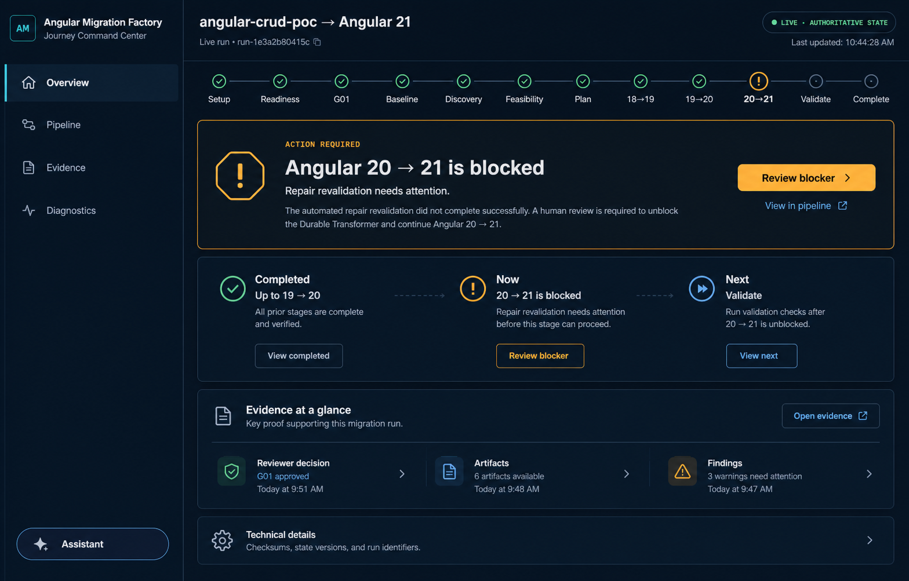
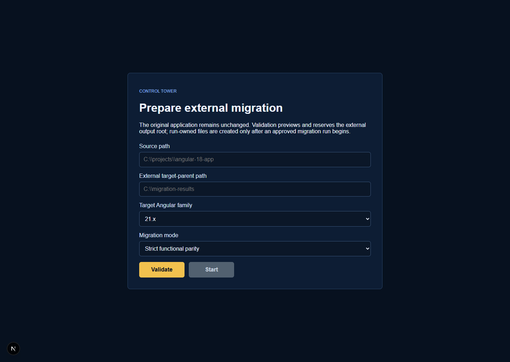
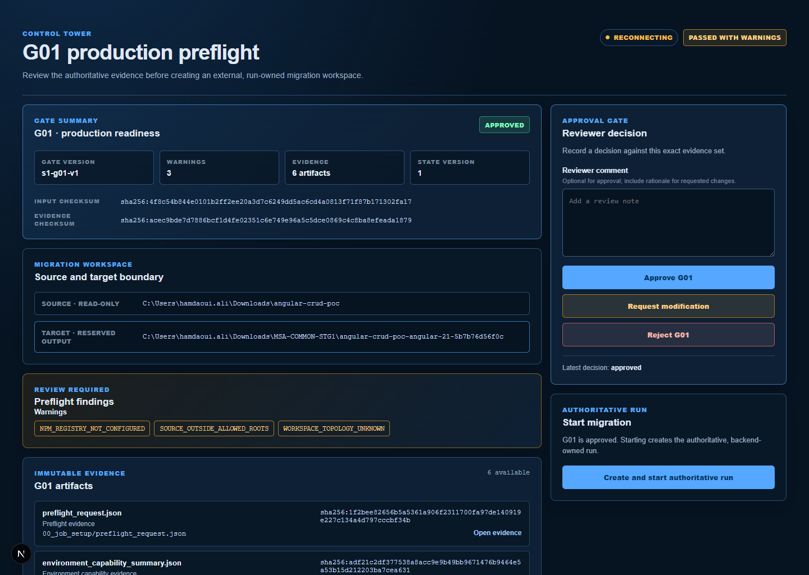
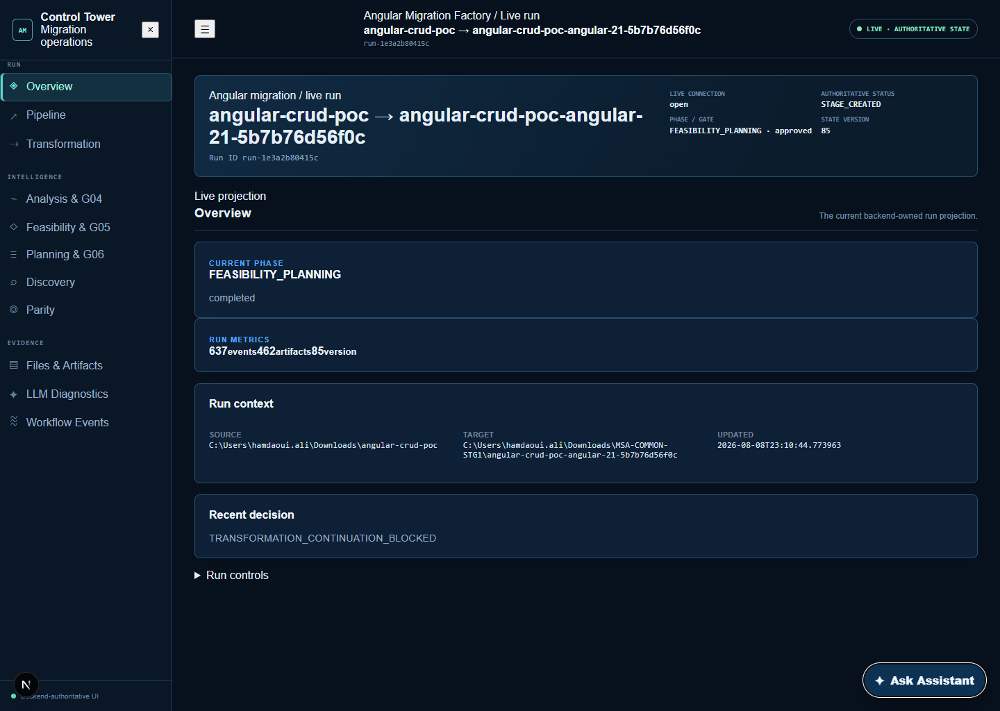
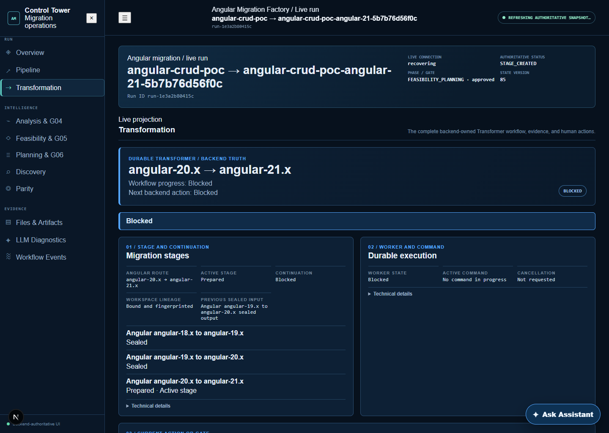
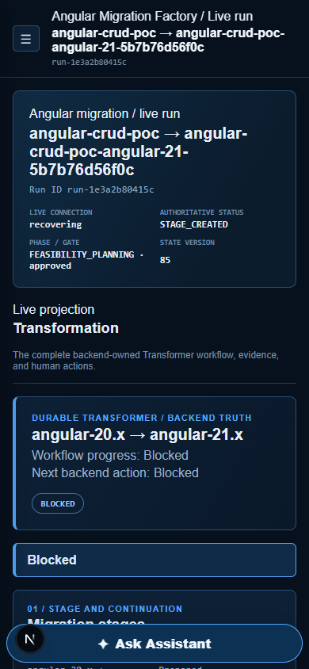
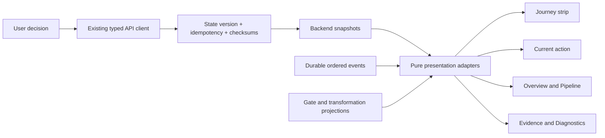

# Angular Migration Factory Journey Command Center Design

**Date:** 2026-08-09  
**Status:** Selected visual direction; written specification awaiting user review  
**Selected direction:** Option 1 — Journey Command Center

## Goal

Redesign the Angular Migration Factory frontend as a clear, journey-first operator workspace without changing backend behavior or weakening backend authority.

At every point, an operator must be able to answer five questions without decoding internal enums:

1. Where am I in the migration journey?
2. What has completed and what evidence proves it?
3. What is happening now?
4. Does a human need to act?
5. What is the next backend-permitted step?

The redesign must preserve the current Next.js/React application, existing routes, typed API clients, immutable evidence model, state-version checks, idempotency protections, SSE recovery behavior, and backend-owned state transitions.

## Proposed Decision

Adopt the Journey Command Center design as the single visual and interaction model for setup, gate review, live-run operations, evidence investigation, diagnostics, and assistant support.

The live-run shell will expose exactly four primary destinations:

- Overview
- Pipeline
- Evidence
- Diagnostics

Transformation becomes a semantic stage inside Pipeline rather than a separate top-level subsystem. Assistant becomes a subordinate drawer rather than a competing primary workspace.

## Why This Direction

Option 1 is the strongest fit because it combines the best parts of the other concepts without making the product feel like a new or unrelated application:

- It keeps the existing serious dark operational character.
- It makes the end-to-end journey continuously visible.
- It places the current human action above metrics and raw state.
- It supports novices with plain-language guidance while preserving technical depth through progressive disclosure.
- It scales from setup through G01–G12 without creating a new navigation item for each backend subsystem.
- It works for both normal progress and failure recovery.
- It is less dense than the evidence-led console and less stage-specific than the guided workspace, making it the best default home for the whole product.

The evidence-led split browser from Option 3 will still inform the Evidence section. The focused review layout from Option 2 will inform gate and stage-detail views. They are supporting patterns, not competing shells.

## Non-Negotiable Product Constraints

The frontend must never:

- invent progress, completion, a gate, a blocker, a next action, or a permitted decision;
- convert a missing or failed backend state into success;
- derive final authority from copy, local timers, optimistic UI, or event-name guesses;
- bypass expected state version, checksum, fingerprint, idempotency, or stale-decision safeguards;
- execute commands directly;
- imply an artifact exists before the backend has registered it;
- make the original source workspace appear writable;
- change backend state-machine behavior as part of this redesign.

The frontend may transform authoritative values into human-readable presentation labels, group durable events into journey milestones, and choose which authoritative fact is most important to show. Every presented state must remain traceable to a backend snapshot, projection, event, gate package, or registered artifact.

## Current-State Audit

The audit used the running frontend at 1440 × 1024 and 390 × 844, the live backend, the current SQLite-backed authoritative run, and current source code. The Browser plugin was unavailable, so the user-approved Playwright fallback used the installed Microsoft Edge browser.

### Captured flow

1. Open the landing page and inspect machine readiness.
2. Open Prepare migration.
3. Enter project and target configuration.
4. Validate the configuration and obtain a production preflight.
5. Review G01 evidence and decisions.
6. Create or reopen the authoritative run.
7. Inspect Overview, Pipeline, Transformation, Evidence, LLM Diagnostics, Workflow Events, and Assistant.
8. Repeat the key screens at a 390 px mobile viewport.

### Current setup

The setup page presents one undifferentiated form with `Validate` and `Start`. It does not explain the readiness stages, why Start is disabled, what will happen next, or that changing configuration invalidates earlier readiness evidence. Internally, the implementation performs path validation, environment checks, source analysis, and production preflight, but the user cannot see that journey.

### Current G01 review

The G01 page contains strong evidence and binding details, but it leads with versions and checksums. An already-approved gate still visually emphasizes approval controls. The decision and run-creation actions compete, and the connection state is more prominent than the plain-language consequence of the approved decision.

### Current live-run Overview

The live run is blocked in the durable transformation continuation, but Overview leads with:

- `STAGE_CREATED`
- `FEASIBILITY_PLANNING`
- state version 85
- 637 events
- 462 artifacts
- `TRANSFORMATION_CONTINUATION_BLOCKED`

The operator must navigate elsewhere or ask Assistant to learn what is actually blocked. The live-run summary and the transformation projection are both backend-owned, but the shell does not reconcile them into a clear current-action presentation.

### Current Transformation

Transformation begins with a useful blocked state, then spreads the workflow across nine numbered sections. “Current action” is section 03, logs are section 04, and critical evidence is lower. The page is organized by implementation concerns instead of the operator’s task.

### Current mobile Transformation

At 390 px, the Transformation document is 21,866 px tall. The persistent Assistant launcher covers content near the bottom of the viewport. Technical content remains expanded in the document flow, so investigation becomes a long scroll rather than a focused task.

## Verified UX and Architecture Problems

| Area | Verified problem | Consequence |
| --- | --- | --- |
| Navigation | Eleven primary destinations are grouped by backend subsystem. | Operators must understand implementation boundaries before they can navigate. |
| Overview | Raw run phase, status, counts, and event names outrank the blocker and next action. | The first screen does not function as an operator dashboard. |
| State presentation | Run snapshot and transformation projection are rendered independently. | A blocked migration can appear “completed” in its phase card. |
| Pipeline | The visible pipeline emphasizes the early baseline sequence and derives stage presentation locally. | Later migration stages and human gates do not form one coherent journey. |
| Pipeline controls | “Summary,” “Command output,” and “Artifacts” are styled as tabs but are non-interactive text. | Controls do not match user expectations or keyboard behavior. |
| Setup | Readiness is hidden behind generic `Validate`; changing inputs silently removes prior results. | Users cannot understand prerequisites or why they must re-run checks. |
| G01 | Evidence quality is high, but action hierarchy and terminal gate behavior are unclear. | Review is cognitively expensive and approved state remains visually actionable. |
| Gates | Review UIs are implemented separately and transformation labels are inaccurate. | G01–G12 do not feel like one governed review system. |
| Transformation | Nine numbered cards put the current task after stage and worker internals. | The operator must scan the implementation before acting. |
| G11/G12 | Current human labels say “Final stage acceptance” and “Delivery approval.” | G11 and G12 are misrepresented; neither label matches backend semantics. |
| Evidence | 462 registered artifacts are rendered as an unfiltered path/checksum list. | Evidence is technically available but operationally undiscoverable. |
| Diagnostics | LLM diagnostics and workflow events are top-level peers with raw metadata. | Investigation is fragmented and primary navigation is crowded. |
| Assistant | Internal identifiers, model metadata, tokens, cost, and long raw summaries dominate. | A support tool competes with the workflow and overwhelms the user. |
| Status | `StatusPill` only replaces underscores with spaces. | Backend vocabulary leaks into the primary interface. |
| Visual system | Global layout rules and `ControlTowerShell.module.css` contain duplicated selectors and mixed shells. | Styling changes are risky and inconsistent. |
| Icons/encoding | Text glyphs are used as icons and multiple source strings contain mojibake. | Visual clarity and assistive-technology output are unreliable. |
| Responsive layout | Mobile content stacks without task-focused reduction. | The app technically fits the viewport but is not practically usable. |
| Test health | Current baseline: 43 passing and 7 failing files; 180 passing and 21 failing tests; 8 unhandled errors. | Redesign work lacks a clean regression signal until the baseline is stabilized. |

## Information Architecture

### Global journey

The same semantic journey appears in Setup, gate review, and live-run contexts:

1. Setup
2. Readiness
3. G01
4. Baseline
5. Discovery
6. Feasibility
7. Plan
8. Angular 18 → 19
9. Angular 19 → 20
10. Angular 20 → 21
11. Validate
12. Complete

The journey does not show a percentage. Each milestone has one of five presentation states derived from backend authority:

- Complete
- Current
- Action required
- Blocked
- Not reached

Unknown or unavailable data is shown as “Not available” and is never converted to “Not reached” or “Complete.”

### Primary run navigation

| Destination | Operator question | Included content |
| --- | --- | --- |
| Overview | What matters now? | Current action, journey, completed/now/next, high-value evidence, technical disclosure. |
| Pipeline | Where is work happening? | Full semantic journey, stage detail, commands, gates G02–G12, transformation, validation, copy-forward. |
| Evidence | What proves this state? | Search, filters, human titles, artifact metadata, preview, provenance. |
| Diagnostics | Why did this happen? | Connection health, blockers, command logs, workflow events, LLM diagnostics, raw payloads. |

Assistant is accessible from a secondary button at the bottom of the navigation and as a contextual action in difficult states. It never becomes a fifth primary destination.

## Authoritative Presentation Model

### Data flow

`AuthoritativeRunDashboard` remains the route-level client boundary. It will compose a presentation projection from the existing run snapshot, durable events, and transformation projection. It will not own domain transitions.

The transformation projection must be lifted to the shell through an enabled, single-owner hook so Overview and Pipeline can show a current transformation blocker without duplicating polling or SSE connections. The existing transformation panel receives that projection as data rather than opening a second independent subscription.

### Current-action precedence

The presentation adapter uses this deterministic priority:

1. A backend-valid pending human gate.
2. A backend transformation projection with `blocked`, `waiting_gate`, `waiting_prompt`, or active-command status.
3. A backend run snapshot with a pending approval or explicit blocked/failure state.
4. A backend run snapshot with active work.
5. A verified complete state.
6. Unknown/unavailable.

This priority selects which authoritative fact receives visual emphasis. It does not change or reconcile backend records. If projections conflict or have incompatible versions, the UI displays “Authoritative state is refreshing” and exposes both records in Diagnostics instead of fabricating a merged state.

### Global action registry

A presentation-only action registry maps a backend-confirmed action to:

- human title;
- explanation;
- consequence;
- target section and stage;
- permitted decision labels returned or supported by the existing API;
- relevant evidence IDs;
- technical source label.

The registry returns no action if the required backend gate package, expected state version, checksum, fingerprint, or permitted decision contract is unavailable.

## Human Gate Language

All gate reviews use one `GateReview` composition with gate-specific content. The labels below are the single frontend vocabulary source.

| Gate | Human label | Operator decision |
| --- | --- | --- |
| G01 | Production readiness | Confirm the environment, source boundary, and reserved target are safe enough to create a run. |
| G02 | Source snapshot | Confirm the immutable source snapshot represents the intended application. |
| G03 | Baseline acceptance | Confirm the known pre-migration state and its proven or attested failures. |
| G04 | Analysis acceptance | Confirm discovery facts, risks, unknowns, and support classification. |
| G05 | Feasibility acceptance | Decide whether the requested migration route may proceed. |
| G06 | Migration plan acceptance | Lock the execution contract, route, commands, validation, recovery, and delivery strategy. |
| G07 | Stage-start acceptance | Confirm the current stage input, workspace fingerprint, and exact stage plan. |
| G08 | Transformation acceptance | Review the official Angular migration output, diffs, migration ledger, and preliminary target version. |
| G09 | Validation acceptance | Review the complete stage validation and parity evidence. |
| G10 | Repair proposal | Apply, reject, or request revision of one exact reviewed repair patch. |
| G11 | Repair validation acceptance | Confirm the applied repair through the normal validation pipeline and error delta. |
| G12 | Stage-completion acceptance | Approve cleanliness, output fingerprint, evidence index, sealing, and copy-forward readiness. |

`G11` must never be labeled “Final stage acceptance.” `G12` must never be labeled “Delivery approval.”

### GateReview content order

Every gate screen uses the same reading order:

1. Why this review exists.
2. What decision is required now.
3. What has already been verified.
4. Warnings, failures, unknowns, and consequences.
5. Evidence grouped by meaning.
6. Reviewer note and backend-permitted decisions.
7. Technical binding details in a collapsed disclosure.

For a terminal approved, rejected, stale, or expired gate, decision buttons are replaced with a clear outcome card. The UI never makes a terminal gate appear pending.

## Screen Designs

### Landing and restoration

The landing screen remains a lightweight entry point. It provides:

- Resume active migration when a valid stored/query run can be loaded.
- Start a new migration.
- Machine readiness summary with a plain-language status.
- A compact explanation of the four-step preparation flow.

Machine diagnostics are summarized; tool paths and raw environment details move behind “View diagnostics.”

### Setup: four explicit steps

#### Step 1 — Project

Collect source path, external target-parent path, target Angular family, and migration mode. Explain the safety boundary: the source remains read-only and output is run-owned outside the source.

Primary action: **Check readiness**.

#### Step 2 — Readiness

Show the real operations already performed by the frontend/backend:

- Path safety and target reservation
- Environment capability
- Source analysis
- Production preflight

Each operation shows waiting, running, passed, warning, blocked, or unavailable based on its actual response. Warnings never look like success and non-blocking warnings are explicitly distinguished from blockers.

If any Step 1 value changes after readiness begins, show an inline **Configuration changed** notice. Prior results may remain visible for comparison but are marked outdated; their authoritative identifiers are not reused. The next action becomes **Check readiness again**.

#### Step 3 — Source review

Summarize detected source version, workspace topology, package manager, project count, builder, known warnings, reserved target, and evidence confidence. Link into the full G01 evidence review.

Primary action: **Review production readiness**.

#### Step 4 — Create run

After an authoritative approved G01 decision, show exactly what will be created and where. The source read-only boundary and generated run root remain explicit.

Primary action: **Create authoritative run**.

### G01 review

G01 uses `GateReview` and retains its strong evidence model. The page replaces headline checksums with:

- Readiness outcome
- Source and target boundary
- Blocking issues
- Warnings requiring acknowledgement
- Evidence groups

Checksums, state version, gate version, input checksum, and artifact-set checksum remain available under Technical details. The sticky decision panel stays visible on desktop and becomes an in-flow bottom decision region on mobile.

### Overview

Overview follows the selected mock:

1. Compact project header and live connection.
2. End-to-end journey strip.
3. Current-action card above the fold.
4. Completed / Now / Next story.
5. Evidence at a glance.
6. Collapsed technical details.

If no action is required, the current-action card becomes a calm “Work in progress” or “Migration complete” card based only on authoritative state. Raw event count, artifact count, run ID, checksums, and state version are removed from the primary hierarchy.

### Pipeline

Pipeline presents the complete journey, not only the baseline sequence. Major groups are:

- Prepare
- Baseline
- Understand
- Decide
- Transform
- Validate and complete

Each row shows a human label, authoritative status, time if available, and evidence count if registered. One row is expanded at a time. Current and action-required rows expand automatically, but the user may inspect completed rows without changing backend state.

The existing pseudo-tabs become real buttons with tab semantics. Summary, Command output, Evidence, and Review are rendered only when their content exists. Keyboard arrow navigation and visible focus are required.

### Transformation inside Pipeline

The numbered section wall is replaced by a task-focused stage workspace:

- Stage summary: route, input, current status, previous sealed output.
- Current action: gate, prompt, command, blocker, or waiting state.
- Evidence: transformation ledger, diffs, version verification, validation summary, repair lineage.
- Activity: active command and logs.
- Technical details: worker lease, continuation node, fingerprints, checksums, raw error codes.

When blocked, the plain-language failure cause and its consequence precede worker state. When a human gate is pending, `GateReview` is the focal content and only backend-permitted decisions are enabled.

### Evidence

Evidence becomes a split investigation workspace on desktop:

- Search by human title, artifact type, stage, or relative path.
- Filter by Relevant, Decisions, Failures, Commands, Reports, and All.
- Group by journey stage and semantic evidence category.
- Select an artifact from a results list.
- Preview with the existing diff, Markdown, JSON, and log viewers.
- Show checksum, artifact ID, relative path, creator, and immutable envelope under Provenance.

The UI does not invent titles from content. Human titles are produced from a deterministic artifact-type/path mapping with the original relative path always available.

On mobile, Evidence uses a list-to-detail flow with a Back to evidence control rather than two compressed panes.

### Diagnostics

Diagnostics consolidates:

- Current blocker and stable error code
- Connection and recovery status
- Command executions and live logs
- Workflow event search and raw payloads
- LLM provider activity, usage, and failures
- Projection mismatch or stale-state information

Diagnostics defaults to the most relevant failure. Raw event streams and provider metadata remain available but no longer occupy primary navigation.

### Assistant

Assistant is a supporting drawer with three modes: closed, minimized, and expanded.

Desktop uses a 420–480 px side drawer that does not obscure the current action. Mobile uses a full-height sheet with one internal scroll region. The fixed launcher must not cover primary controls or content.

Assistant responses lead with:

- Current state
- What is waiting
- Why it is blocked
- Next permitted action
- Evidence links

Internal feature IDs, model name, capability keys, confidence metadata, tokens, and cost move behind Response details. Existing persisted conversation and evidence authority remain unchanged.

The unconditional router dependency in `AssistantNextSteps` must be isolated so empty proposal sets render without a Next router. This removes the current unhandled test/runtime failure without weakening route-based proposals.

## Visual System

### Color tokens

The implementation will use flat colors without gradients or glow:

| Token | Value | Use |
| --- | --- | --- |
| `--color-bg` | `#07111F` | Application background |
| `--color-surface-1` | `#0C1A2B` | Primary panels |
| `--color-surface-2` | `#10243A` | Elevated/selected panels |
| `--color-border` | `#29465F` | Standard borders |
| `--color-text` | `#F4F7FB` | Primary text |
| `--color-text-muted` | `#AAB9C9` | Secondary text |
| `--color-accent` | `#58C4E6` | Navigation, links, focus |
| `--color-success` | `#58D99A` | Backend-verified completion |
| `--color-warning` | `#FFB547` | Human action and warning |
| `--color-danger` | `#F07178` | Actual failure/rejection |

Contrast must be verified in the rendered UI. If a specified value fails WCAG AA in its actual pairing, implementation adjusts the token rather than preserving the mock literally.

### Typography and spacing

- Use the local system sans stack headed by `Segoe UI`; do not add a remote font dependency.
- Body text: 16 px minimum, 1.5 line height.
- Supporting metadata: 13–14 px minimum and never the only carrier of important meaning.
- Limit explanatory text to approximately 72 characters per line.
- Use sentence case for headings and labels.
- Use uppercase/letter-spacing only for short nonessential eyebrow labels.
- Spacing scale: 4, 8, 12, 16, 24, 32, and 48 px.
- Panel radii: 10–12 px; control radii: 8–10 px.
- Minimum pointer target: 44 × 44 px.

`lucide-react` will replace text-symbol icons. Every informative icon receives an accessible name or adjacent visible label; decorative icons are hidden from assistive technology.

### Motion

Use short 120–180 ms transitions for drawer, disclosure, and focus changes. Respect `prefers-reduced-motion` and avoid animated status indicators that are the only signal of activity.

## Responsive Behavior

### Desktop: 1200 px and above

- Persistent 260–280 px sidebar.
- Horizontal journey strip.
- Overview evidence row and Evidence split view.
- Sticky gate decision rail where useful.
- Assistant side drawer.

### Tablet: 768–1199 px

- Collapsible navigation drawer.
- Journey wraps to two rows or shows the current journey window.
- Two-column layouts collapse when content would drop below readable widths.
- Gate decisions remain near the evidence they govern.

### Mobile: below 768 px

- Compact header with project name, connection, and menu.
- Navigation drawer contains only four destinations and Assistant.
- Journey shows Previous / Current / Next with an expandable full journey.
- Current action remains above supporting detail.
- Cards become single-column.
- Evidence uses list-to-detail navigation.
- Gate decisions are in flow and never obscured by fixed controls.
- Assistant is a full-height sheet with focus return.
- No horizontal document overflow at 390 px.

## Accessibility Requirements

- One `h1` per route and a logical heading hierarchy.
- Skip link to main content.
- Semantic `nav`, `main`, `section`, `aside`, `dialog`, `status`, and `alert` roles where appropriate.
- Real tabs only where tab behavior exists; otherwise use buttons/disclosures.
- Visible focus at least 2 px with sufficient contrast.
- Full keyboard operation for navigation, journey inspection, gate decisions, evidence selection, disclosures, and Assistant.
- Focus moves to new blocking errors and returns to the invoking control when drawers close.
- Status never relies on color alone; pair icon, label, and concise text.
- Live updates use restrained `aria-live` regions and do not re-announce the whole dashboard.
- Long IDs, paths, and checksums wrap or scroll within their own region without widening the page.
- Form errors identify the field, cause, and next correction.
- Copy avoids unexplained acronyms and raw enum labels in primary content.

## Error and Recovery Presentation

| Condition | Presentation |
| --- | --- |
| Initial loading | Skeletons preserve layout; current state is not guessed. |
| SSE connecting/recovering | Quiet connection label; last confirmed state remains marked with its timestamp. |
| Event gap | “Refreshing authoritative state”; controls requiring fresh state are disabled. |
| Snapshot/projection mismatch | Current action withheld; Diagnostics exposes both sources and versions. |
| Stale decision `409` | Explain that evidence changed, reload authoritative package, preserve the reviewer’s draft comment locally, require a new decision. |
| Backend validation `4xx` | Show stable error message near the action and correlation ID in Technical details. |
| Backend `5xx`/network failure | Keep confirmed state, show retry, do not show success. |
| Missing evidence | “Evidence not available”; no placeholder artifact or inferred link. |
| Blocked continuation | Plain cause, consequence, evidence, and only backend-permitted recovery action. |
| Terminal gate | Read-only outcome and decision provenance; no active decision buttons. |

## Component Architecture

### New presentation modules

- `frontend/src/presentation/runJourney.ts` — pure conversion of authoritative run/events/stages into journey milestones.
- `frontend/src/presentation/currentAction.ts` — deterministic current-action precedence and target routing.
- `frontend/src/presentation/gates.ts` — G01–G12 labels, descriptions, evidence groups, and decision vocabulary.
- `frontend/src/presentation/status.ts` — centralized human labels, tone, icon name, and raw-value fallback.
- `frontend/src/presentation/artifacts.ts` — deterministic artifact title/category mapping and filters.

Each module is pure, contains no fetch or mutation, preserves raw values for Technical details, and has focused unit tests.

### New shared components

- `frontend/src/components/control-tower/RunJourneyStrip.tsx`
- `frontend/src/components/control-tower/CurrentActionCard.tsx`
- `frontend/src/components/control-tower/OperatorOverview.tsx`
- `frontend/src/components/control-tower/TechnicalDetails.tsx`
- `frontend/src/components/control-tower/EvidenceWorkspace.tsx`
- `frontend/src/components/control-tower/DiagnosticsWorkspace.tsx`
- `frontend/src/components/gates/GateReview.tsx`
- `frontend/src/components/gates/GateDecisionPanel.tsx`

These components consume typed presentation objects. They do not inspect raw event names independently.

### Existing components to refactor

| File | Change |
| --- | --- |
| `frontend/src/components/AuthoritativeRunDashboard.tsx` | Become the thin shell/composition owner; lift transformation projection; render four destinations. |
| `frontend/src/components/control-tower/ControlTowerSidebar.tsx` | Reduce to four destinations, use real icons, expose action indicator without auto-navigation. |
| `frontend/src/components/control-tower/ControlTowerHeader.tsx` | Human project title, quiet connection state, mobile-safe layout, correct encoding. |
| `frontend/src/components/control-tower/PipelineSection.tsx` | Render full semantic journey and real tabs/disclosures. |
| `frontend/src/components/control-tower/WorkflowEventsSection.tsx` | Move into Diagnostics and improve event naming without hiding raw payloads. |
| `frontend/src/components/MigrationSetupForm.tsx` | Four-step preparation flow and explicit configuration invalidation. |
| `frontend/src/components/MigrationSetupForm.module.css` | Step layout, readiness list, responsive actions. |
| `frontend/src/components/G01ReviewPanel.tsx` | Compose `GateReview`; terminal-state-safe decisions. |
| `frontend/src/components/G01ReviewPanel.module.css` | Adopt shared tokens and responsive decision layout. |
| `frontend/src/components/TransformationPanel.tsx` | Receive projection; current task first; remove numbered wall. |
| `frontend/src/components/TransformationSections.tsx` | Recompose stage, action, evidence, activity, and technical sections; correct G11/G12 labels. |
| `frontend/src/components/TransformationPanel.module.css` | Replace numbered grid with focused stage workspace. |
| `frontend/src/components/ArtifactPreviewPanel.tsx` | Integrate into Evidence master/detail flow and provenance disclosure. |
| `frontend/src/components/LlmDiagnosticsPanel.tsx` | Become a Diagnostics subsection; human summary before provider metadata. |
| `frontend/src/components/AssistantPanel.tsx` | Subordinate drawer, concise answer hierarchy, router isolation, mobile sheet. |
| `frontend/src/components/AssistantMessage.tsx` | Separate answer, evidence, action, and response details. |
| `frontend/src/components/AssistantEvidenceDrawer.tsx` | Use shared evidence titles and preview patterns. |
| `frontend/src/components/StatusPill.tsx` | Consume centralized status presentation instead of replacing underscores. |
| `frontend/src/app/page.tsx` | Updated landing/restoration hierarchy without changing restoration authority. |
| `frontend/src/app/migrations/new/page.tsx` | Preparation shell/step context. |
| `frontend/src/app/preflights/[preflightId]/page.tsx` | Shared journey and G01 review context. |
| `frontend/src/app/migrations/[runId]/page.tsx` | Preserve authoritative route and adapt mock fixtures to the same visual shell. |

### Styling consolidation

- `frontend/src/app/globals.css` owns reset, typography, focus, and design tokens.
- `frontend/src/components/control-tower/ControlTowerLayout.module.css` owns only shell and responsive layout.
- `frontend/src/components/ControlTowerShell.module.css` remains temporarily as shared component primitives because many panels import it, but duplicate rules are removed and names are made unambiguous.
- Feature modules own feature-specific layout only.
- `ControlTowerShell.tsx` and `RunDashboard.tsx` no longer define a separate visual language. Mock runs pass through a compatibility adapter and render the same workspace primitives.

The implementation must not perform a wholesale CSS rename before behavioral tests exist. Consolidation proceeds component by component with visual regression checks.

## Testing Strategy

### Phase-zero baseline stabilization

Before visual refactoring, make the current frontend suite a reliable signal. The captured baseline has:

- 50 test files total
- 43 passing files
- 7 failing files
- 201 tests total
- 180 passing tests
- 21 failing tests
- 8 unhandled errors

Known failing areas are `AnalysisReviewPanel`, `AssistantPanel`, `BaselineParityPanel`, `FeasibilityPanel`, `LlmDiagnosticsPanel`, and `MigrationPlanPanel`. The Assistant failures include the unconditional Next router hook. Fix or update these failures only where they reflect current authoritative contracts; do not weaken assertions to obtain green output.

### Unit tests

Add exhaustive tests for:

- status label/tone mapping, including unknown raw values;
- G01–G12 human labels and terminal states;
- current-action precedence;
- projection mismatch behavior;
- journey milestone derivation from ordered events;
- no completion when required evidence/event is absent;
- artifact categorization and human titles;
- setup configuration invalidation;
- stale decision draft preservation;
- mobile presentation state helpers where logic is involved.

### Component tests

Update and extend:

- `AuthoritativeRunDashboard.test.tsx`
- `ControlTowerPresentation.test.tsx`
- `MigrationSetupForm.test.tsx`
- `G01ReviewPanel.test.tsx`
- `TransformationPanel.test.tsx`
- `AssistantPanel.test.tsx`
- `AssistantPanel.r7.test.tsx`
- `LlmDiagnosticsPanel.test.tsx`
- existing G02–G06 panel tests

Required scenarios include every actionable gate G01–G12, approved/rejected/stale/expired states, blocked transformation, running command, reconnecting/event gap, empty evidence, missing diagnostics, keyboard tabs/disclosures, and Assistant drawer focus behavior.

G11 and G12 require explicit actionable component tests, not only event-history tests.

### Integration and contract tests

- Preserve typed API request/response contracts.
- Assert expected state version, idempotency key, checksums, and workspace fingerprint are sent for decisions.
- Assert `409` reloads the active gate package and does not report success.
- Assert out-of-order or duplicate events do not regress the projection.
- Assert an event gap disables fresh-state actions until snapshot recovery.
- Assert the source path remains read-only in all copy and actions.

### Browser QA

Use the approved Playwright fallback with installed Edge because the Browser plugin is unavailable. Test the real local frontend/backend at:

- 1440 × 1024 desktop
- 834 × 1194 tablet
- 390 × 844 mobile

Verify:

1. Landing → Prepare migration.
2. Project → Check readiness → configuration changed → recheck.
3. G01 evidence review → approved terminal state → create run.
4. Overview current action → Pipeline focused stage.
5. G02–G12 review states using backend-valid fixtures.
6. Evidence search/filter/select/preview/provenance.
7. Diagnostics blocker/log/event/provider investigation.
8. Assistant open/minimize/close, focus return, and mobile sheet.
9. Keyboard-only navigation and decisions.
10. No horizontal overflow or fixed-control obstruction.
11. Reference-to-build visual comparison at identical viewport and state.

Console errors, failed requests, and accessibility violations are release blockers unless explicitly caused by an intentional aborted stream during navigation and documented by the test.

### Build gates

The redesign is complete only when all of these pass:

- `npm test`
- `npm run typecheck`
- `npm run lint`
- `npm run build`
- Browser journey checks at all three viewport sizes
- Screenshot comparison against the selected design direction

## Delivery Sequence

1. Stabilize relevant frontend tests and record a green baseline.
2. Add presentation adapters and exhaustive mapping tests.
3. Add tokens, icon dependency, and shared primitives.
4. Rebuild Setup and G01 using the shared journey/gate model.
5. Replace the live-run shell with four primary destinations and Operator Overview.
6. Rebuild Pipeline and integrate Transformation plus G02–G12 review.
7. Build Evidence and consolidate Diagnostics.
8. Refactor Assistant into a subordinate accessible drawer.
9. Remove duplicated shell/CSS rules and adapt the mock route.
10. Complete accessibility, responsive, full-suite, build, and browser verification.

Each sequence step must remain runnable and reviewable. No step may leave the frontend with two competing primary shells.

## Risks and Mitigations

| Risk | Mitigation |
| --- | --- |
| A presentation adapter accidentally becomes a second state machine. | Keep adapters pure; map only explicit backend facts; exhaustive unknown and absence tests. |
| Lifting transformation state duplicates subscriptions or requests. | One enabled hook owner in the shell; pass projection downward. |
| CSS consolidation breaks many legacy panels. | Stabilize tests first; migrate feature by feature; keep temporary shared primitives. |
| A four-item navigation hides useful specialist screens. | Preserve all content under Pipeline, Evidence, or Diagnostics with direct contextual links. |
| Mobile progressive disclosure hides critical action. | Current action and gate decision remain expanded; only technical/supporting detail collapses. |
| Human labels drift from backend meaning. | Central G01–G12 mapping tests tied to documented gate purposes. |
| Visual mock implies unavailable data. | Implement layout and hierarchy faithfully but render only data exposed by current typed APIs. |
| Existing failing tests obscure regressions. | Phase-zero stabilization before broad UI edits; no assertion weakening. |

## Success Criteria

The redesign succeeds when:

- A blocked run states the blocker and next permitted action above the fold on Overview.
- The run shell has exactly four primary destinations.
- The full Setup → G01 → G02–G12 → validation → completion journey is visible without exposing subsystem navigation.
- Any backend-valid pending G01–G12 gate produces one consistent Action required experience.
- G11 and G12 use their real semantics and have actionable tests.
- Setup shows four steps and explicit configuration invalidation.
- Evidence can be found and previewed without scanning hundreds of paths.
- Diagnostics contains raw technical depth without making it the default experience.
- Assistant supports the workflow without covering it.
- No primary heading is an unexplained backend enum.
- The 390 px mobile UI has no horizontal overflow and no fixed control covering the current action.
- All automated and browser gates pass.
- No backend behavior, authority, idempotency, immutability, or safety contract is weakened.

## Scope Boundaries

This redesign does not:

- change backend state transitions or gate policies;
- add new backend commands or decisions;
- fabricate missing G13+ flows;
- replace registered artifacts with generated summaries;
- introduce analytics, billing, deployment, or unrelated administration;
- redesign the migrated Angular applications themselves;
- deploy or publish the frontend.

If the current backend lacks a projection needed by the selected mock, the frontend shows a truthful unavailable state. A separate backend change requires its own design and authorization.
