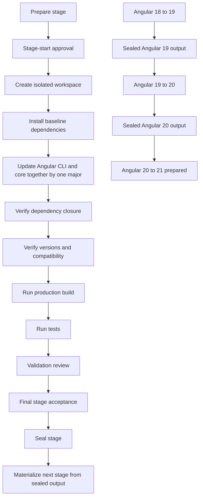
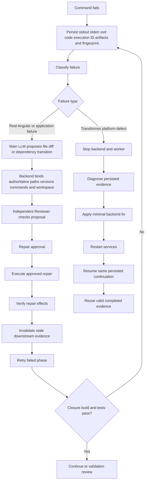
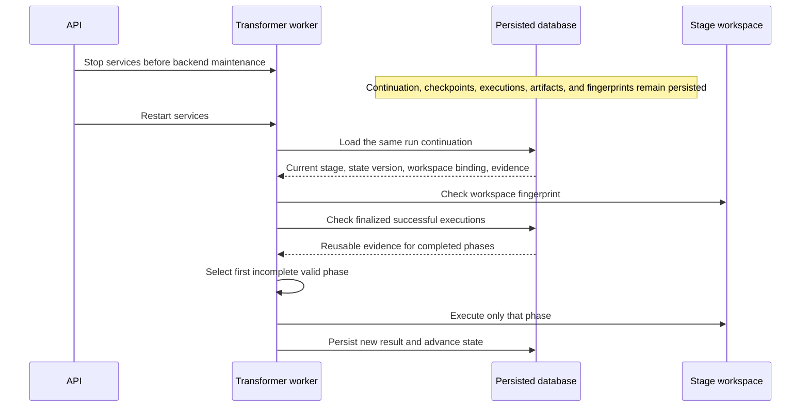

# Angular Transformer E2E Workflow

This document describes the Angular Transformer workflow that is implemented in the repository and proven by the persisted runtime execution. It describes an MVP for the exercised Angular application and dependency set; it is not a claim of generic migration support for every Angular application.

## 1. Executive summary

The Transformer moves an Angular application from one Angular major version to the next in isolated, reviewable stages. Each stage installs the dependency tree, updates Angular CLI and Angular core together, verifies the resulting dependency and workspace evidence, runs the existing production build and tests, obtains the required authorized decisions, and seals the result.

The one-major-at-a-time design makes each migration boundary independently auditable:

```text
Angular 18 → 19
       ↓ sealed output
Angular 19 → 20
       ↓ sealed output
Angular 20 → 21 prepared
```

The runtime proved that Angular 18→19 and Angular 19→20 completed and were sealed. Angular 20→21 was prepared and intentionally stopped before its stage-start approval. The original source remained unchanged, and the proof was performed through the backend and worker rather than the frontend.

The proof covers this application, this dependency set, and the two completed major-version stages. It does not establish generic production readiness or support for every Angular application.

## 2. Actors and responsibilities

| Actor or component | Responsibility |
|---|---|
| User / human decision maker | Reviews the evidence package at the required decision points and authorizes the next controlled action. |
| Backend orchestration | Owns the durable state machine, stage plans, workspaces, fingerprints, repair attempts, evidence, decisions, checkpoints, and seals. |
| Transformer worker | Loads the persisted continuation and executes authorized commands one phase at a time. |
| Main LLM | Proposes either a file diff or a dependency-transition repair after a real migration failure. |
| Independent Reviewer | Checks the proposed repair before it can be authorized. |
| Command executor | Resolves an approved command definition, runs it in the bound stage workspace, and records stdout, stderr, exit code, artifacts, and fingerprints. |
| Stage workspace | Isolated filesystem copied from the approved source or a previous sealed stage. |
| Persisted database and artifacts | Durable source of truth for state, execution history, decisions, checksums, checkpoints, repair ledgers, validation summaries, and sealed manifests. |

## 3. Complete E2E workflow schema



## 4. Normal successful workflow

### Prepare the stage

**Owner:** Backend orchestration.

The backend creates a stage plan for one Angular-major transition. The plan contains the source and target major versions, authorized command definitions, expected validation phases, workspace binding, and evidence requirements.

**Input:** The original approved source or the previous sealed stage.

**Output:** A durable stage continuation and an approved stage plan.

**Completion condition:** The stage exists in the persisted run and is waiting for stage-start approval.

### Stage-start approval

**Owner:** Human decision maker and backend.

The decision is bound to the stage plan, the expected state version, the package/evidence checksum, and the workspace fingerprint. The worker does not start the stage until the decision is accepted by the backend.

**Output:** An authorized decision recorded in the database.

### Create the isolated workspace

**Owner:** Backend orchestration.

The backend creates or restores a stage workspace under the allowed target root. For a later stage, the source is the previous sealed output. The workspace receives a deterministic fingerprint.

**Input:** Approved source or sealed previous-stage output.

**Output:** Stage workspace binding, checkpoint, and workspace fingerprint.

**Completion condition:** The physical workspace fingerprint matches the persisted expected fingerprint.

### Install baseline dependencies

**Owner:** Transformer worker and command executor.

The worker runs the authorized baseline install command in the isolated workspace. In the proven flow this was `npm ci` for the initial baseline installation.

`npm ci` installs from the committed lockfile and verifies the frozen dependency tree. It is not a dependency repair mechanism and does not use `--force` to bypass npm resolution.

**Output:** Command execution, exit code, stdout/stderr artifacts, and post-command workspace evidence.

**Completion condition:** The command exits successfully and the recorded evidence is finalized.

### Update Angular CLI and core together

**Owner:** Transformer worker and command executor.

The authorized Angular update moves Angular CLI and Angular core together by one major version. The stages are therefore:

```text
18 → 19
19 → 20
20 → 21
```

The exact command is selected by the backend command registry and executed in the stage workspace. The worker does not independently invent command arguments.

**Output:** Angular update execution, migration output, artifacts, exit code, and updated workspace fingerprint.

**Completion condition:** The Angular update exits successfully and its evidence is accepted by the phase runner.

### Verify dependency closure

**Owner:** Backend validation services.

The Transformer checks that the target Angular dependency set is coherent. The check includes target-major compliance, peer compatibility, and agreement between package declarations, lockfile resolutions, and installed metadata.

Framework and CLI packages may legitimately have different compatible patch versions. Exact patch equality across every Angular package is not required; compatible target-major resolution and peer agreement are required.

**Output:** Dependency and compatibility evidence with checksums and the current workspace fingerprint.

**Completion condition:** No unresolved dependency conflict remains in the authorized target-major tree.

### Verify versions and compatibility

**Owner:** Backend validation services.

The verification phase checks the Angular package metadata and the project configuration, including the manifest, lockfile, installed package metadata, Angular CLI, Angular build package, and the configured runtime/tooling compatibility evidence.

The persisted run explicitly proves the Angular package, manifest, lockfile, and installed-tree checks described in the technical appendix. This document does not claim an independent Node, TypeScript, or RxJS compatibility result unless the corresponding installed versions and official ranges are present in the persisted evidence.

**Output:** Version-verification execution, artifacts, checksum, and workspace fingerprint.

**Completion condition:** The observed target version and dependency evidence satisfy the stage plan.

### Run the production build

**Owner:** Transformer worker.

The build command comes from the existing project configuration. The Transformer does not replace it with a generic build command.

**Output:** Build execution record, stdout/stderr, artifacts, exit code, and checksum.

**Completion condition:** The configured production build exits successfully.

### Run tests

**Owner:** Transformer worker.

The test command also comes from the existing project configuration. The Transformer records the test output rather than treating a command exit code alone as the complete evidence package.

**Output:** Test execution record, output artifacts, exit code, and checksum.

**Completion condition:** The configured test command exits successfully.

### Validation review

**Owner:** Human decision maker and backend.

The human reviews the completed technical validation package: command results, artifacts, checksums, workspace fingerprint, and any repair evidence. The backend accepts the decision only when it matches the expected state and evidence package.

**Output:** Authorized validation decision.

### Final stage acceptance

**Owner:** Human decision maker and backend.

The human accepts the complete stage result after the technical validation evidence is available. This is separate from the earlier validation review because it authorizes committing the stage as a reusable migration boundary.

**Output:** Authorized final acceptance decision.

### Seal the stage

**Owner:** Backend orchestration.

The backend creates an immutable sealed-output manifest containing the stage lineage, evidence references, checksums, and final workspace fingerprint. The database records that the stage is sealed and safe for resume/materialization.

**Completion condition:** The sealed manifest and database seal state are both persisted.

### Materialize the next stage

**Owner:** Backend orchestration.

The next Angular-major stage is created from the sealed output, not from an unverified working directory. This preserves stage-by-stage lineage.

## 5. Failure and repair workflow schema



### Real migration failures

A real migration failure is a problem in the application's Angular dependency graph, migration command, build, or tests. The failure is preserved as part of the audit trail.

The Main LLM may propose:

- a file diff; or
- a dependency-transition plan.

The backend then binds the proposal to authoritative paths, package names, versions, command templates, stage, repair attempt, and workspace. The Reviewer checks that bound proposal. A repair approval is required before execution.

After the repair runs, the backend verifies the effects and retries only the failed phase. Any downstream evidence affected by the workspace change is invalidated and must be regenerated.

### Transformer platform defects

A platform defect is a failure in orchestration, command registration, state persistence, sealing, idempotency, or recovery. The correction is made in the backend and worker, not in the application workspace.

The runtime-proven recovery sequence is:

```text
Stop API and worker
→ inspect database and persisted execution evidence
→ identify root cause
→ apply smallest backend fix
→ compile/check the backend
→ restart API and worker
→ resume the same persisted run
```

## 6. Evidence reuse and invalidation

Successful phases are reusable only when their finalized evidence still matches the currently authorized workspace fingerprint and stage binding.

A repair that changes the workspace can invalidate downstream evidence. For example, changing dependencies invalidates any build or test result that was produced before the dependency change. Those affected phases must run again.

Completed unaffected phases may be reused. The worker does not rerun successful commands simply because the process was restarted or because a later phase failed.

Retries receive distinct auditable identities. The runtime duplicate audit found no duplicate idempotency keys in the persisted command-execution table.

That audit proves uniqueness of the recorded idempotency keys. It does not claim that every possible semantic duplicate was ruled out by normalized command arguments, phase, stage, and workspace comparison. Such a stronger claim is not made here.

## 7. Angular 19→20 real example

The proven Angular 19→20 path was:

```text
Dependency conflict
→ blocking dependency temporarily removed
→ Angular update retried
→ mixed Angular package patches detected
→ manifest and lockfile normalized
→ compatible exact dependency reattached
→ npm ci recreated the installed tree
→ Angular versions verified
→ production build passed
→ tests passed
→ validation decision recorded
→ final acceptance recorded
→ stage sealed
```

### Real Angular/npm failures

The first Angular 20 update failed during npm peer resolution. The persisted execution evidence shows that `jest-preset-angular` blocked the target Angular build-package resolution. The exact original package version is not stated here because it is not being inferred from the summary; it must be read directly from the failed execution's package evidence before making that claim.

After the blocking dependency was removed and Angular was retried, npm exposed a second real dependency problem: Angular packages had mixed patch resolutions. The dependency tree was not accepted in that state.

The manifest and lockfile were normalized, the approved exact dependency was reattached, and a clean `npm ci` recreated the installed tree. The final evidence showed:

```text
@angular/core                         20.3.27
@angular/cli                          20.3.33
@angular-devkit/build-angular         20.3.33
@angular/platform-browser-dynamic     20.3.27
jest-preset-angular                   14.6.2
```

The manifest, lockfile, and installed metadata agreed for the checked packages. The production build and tests then passed.

### Transformer platform defects encountered

The repair path also exposed Transformer defects:

- a lockfile-normalization command was not registered for worker execution;
- the transition runner attempted reinstall before confirming normalized Angular resolution;
- a final queue key exceeded the backend's idempotency-key length limit;
- earlier sealing and validation recovery logic had stale-evidence problems.

These were fixed in the backend, with the API and worker stopped before edits and restarted before resuming the same persisted run.

### Authorized decision pauses

The workflow paused for the repair approval, validation review, and final stage acceptance. These decisions were tied to the relevant evidence package, checksum, workspace fingerprint, state version, decision identity, and idempotency key.

### Why `--force` was not used

`--force` was not used because it would bypass npm's peer-dependency safety checks and could produce an internally inconsistent dependency tree. The workflow instead resolved the conflict explicitly, normalized the Angular package resolution, reattached the approved dependency version, and proved the result with `npm ci`, version verification, build, and tests.

## 8. Restart and recovery workflow



The backend uses optimistic concurrency. API decisions and restart requests include an expected state version. If the worker advances the run first, a stale request receives a state conflict instead of overwriting newer progress.

Workspace fingerprints bind evidence to the physical stage workspace. Checkpoints provide recoverable workspace lineage. Execution records provide command-level history. Idempotency keys prevent the same accepted command request from starting twice.

## 9. Human and authorized decision points

### Before a stage starts

The stage-start decision authorizes the stage plan and its isolated workspace. It is bound to the expected state version, package checksum, artifact-set checksum, workspace fingerprint, decision identity, and idempotency key.

### Before an LLM repair executes

The repair decision authorizes the exact reviewed proposal. The proposal must already be bound to authoritative package names, versions, commands, paths, stage, repair attempt, and workspace.

### After technical validation

The validation decision confirms that the build, tests, version checks, dependency evidence, and repair evidence are acceptable for the current workspace fingerprint.

### Before the stage is sealed

The final acceptance decision authorizes sealing the completed stage. The backend rejects stale or mismatched decisions whose state version, checksum, or workspace fingerprint no longer matches the current run.

## 10. Current proven status

The persisted runtime proves:

- Angular 18→19 completed and was sealed.
- Angular 19→20 completed and was sealed.
- Angular 20→21 was prepared and is waiting for stage-start approval.
- No Angular 20→21 migration command executed.
- The original source remained unchanged.
- The frontend was not used for the proof.
- The backend API and Transformer worker were stopped after the completed proof.

## 11. Limits of the proof

The proof covers:

- this application;
- this dependency set;
- Angular 18→19;
- Angular 19→20;
- the persisted runtime behavior observed in the completed run.

It does not prove:

- successful migration of all Angular applications;
- resolution of every possible dependency conflict;
- all possible file-repair scenarios;
- completion of Angular 20→21;
- production regression safety beyond the recorded build and test commands;
- an independent Node, TypeScript, or RxJS compatibility claim unless the corresponding installed versions and official compatibility ranges are explicitly present in the runtime evidence.

The separately persisted lockfile-generation step remained pending in the final stage-step projections. The successful dependency-transition normalization and final `npm ci` provide the dependency evidence used for the sealed stages, but that separate step is marked `NOT_PROVEN` rather than silently treated as passed.

## 12. Technical evidence appendix

### Runtime identifiers

```text
Run:          run-a75434dbe131
Continuation: transform-ffc3d836a598
Database:     C:\amf-data\r03\control-tower.db
Source root:  C:\Users\abdelilah.mortaki\Desktop\angular-crud-poc
Target root:  C:\a\r03
```

### Stage identifiers and seals

| Stage | Stage ID | Result | Seal / manifest evidence | Workspace fingerprint |
|---|---|---|---|---|
| Angular 18→19 | `angular-18-to-19--b473161978b8903f` | PASS | `seal-angular-18-to-19--b473161978b8903f`; manifest `artifact-d33703986f7f46aa876f6527dff9bebd`; manifest checksum `sha256:7a4dd811a1cf17ef67f6...` | `sha256:a9177d2c42c7143d8ae11acbe1f44197ebed852937b7a106bf728a93a27998bb` |
| Angular 19→20 | `angular-19-to-20--a13b61bb4c831fa5` | PASS | `seal-angular-19-to-20--a13b61bb4c831fa5`; manifest `artifact-f731f6e0944f4c198f060f34d1cab83e`; manifest checksum `sha256:60856e519dbfcad722924d83f5c00872c94fdcd42ef5a05fb47f5dcef61771e1` | `sha256:f2d764ff789198a4a6595ec61d0cf7955ddfe4a775d8ec1a56aac803f013ba28` |
| Angular 20→21 | `angular-20-to-21--6b85ef3cbb38bc3a` | NOT_PROVEN | Prepared only; no seal | Prepared stage fingerprint not used for migration completion |

### Stage and command evidence

| Stage | Phase | Execution/artifact | Result | Workspace fingerprint | Proof status |
|---|---|---|---|---|---|
| 18→19 | Bootstrap install | `exec-13223d34a191` | Exit 0 | `sha256:1e47c9bb3d637458f2e70e72d049839ad8869cbf8b8c49892bfe2eace9a945e8` | PASS |
| 18→19 | Angular update | `exec-7265d9c47861` | Exit 0 | Final Stage 1 fingerprint | PASS |
| 18→19 | Version verification | `exec-c98734d433fa` | Exit 0; target evidence persisted | `sha256:a9177d2c42c7143d8ae11acbe1f44197ebed852937b7a106bf728a93a27998bb` | PASS |
| 18→19 | Production build | `exec-82a103694146` | Exit 0; output checksum `sha256:a7b038afa616b260efe646746e2a04e6b133ccb87a5d9f531f64b7873a001dd7` | `sha256:a9177d2c42c7143d8ae11acbe1f44197ebed852937b7a106bf728a93a27998bb` | PASS |
| 18→19 | Tests | `exec-50ca67eaa801` | Exit 0 | Final Stage 1 fingerprint | PASS |
| 18→19 | Final install | `exec-025738066aa4` | Exit 0 | Final Stage 1 fingerprint | PASS |
| 18→19 | Lockfile-generation projection | Database stage-step row | Remained `PENDING` | Final Stage 1 fingerprint | NOT_PROVEN |
| 19→20 | Initial bootstrap | `exec-3b29c891e68d` | Exit 0 | `sha256:a9177d2c42c7143d8ae11acbe1f44197ebed852937b7a106bf728a93a27998bb` | PASS |
| 19→20 | Initial Angular update | `exec-f502e74eaef1` | Exit 1; npm peer-resolution failure | Initial Stage 2 fingerprint | FAIL |
| 19→20 | Repair proposal | `artifact-9e44bc7767de48e3b44e51633e6912cf`; checksum `sha256:1792cf4e21c7f11914a3b9416f1c3107a5d5775b93c0841f2feec34a511ebcee` | Persisted | Repair attempt workspace | PASS |
| 19→20 | Reviewer | `artifact-4accc351b76644e99eb17de21ab91245`; checksum `sha256:221735cf7e7b320240cdf31cc3c6898ae44146e80afe4ea80ffe110b15aae1be` | Persisted | Repair attempt workspace | PASS |
| 19→20 | Dependency uninstall | `exec-3d39b02b3519` | Exit 0 | Repair workspace | PASS |
| 19→20 | Angular retry | `exec-22adc84057c4` | Exit 0 | Repair workspace | PASS |
| 19→20 | First dependency reattach | `exec-1ef4de9b92c9` | Exit 1; mixed Angular patches / ERESOLVE | Repair workspace | FAIL |
| 19→20 | Generic lockfile generation | `exec-ea28554b9deb` | Exit 1; ERESOLVE | Repair workspace | FAIL |
| 19→20 | First normalization | `exec-82b314e1119e` | Exit 0 but insufficient persisted alignment | Repair workspace | NOT_PROVEN |
| 19→20 | Unregistered normalization attempt | `exec-7071d74f42e1` | Pre-spawn failure; command not registered | Repair workspace | FAIL |
| 19→20 | Correct normalization | `exec-3cdf6d3197bb` | Exit 0 | Final Stage 2 fingerprint | PASS |
| 19→20 | Exact dependency reattach | `exec-2e617a1f6cd8` | Exit 0 | Final Stage 2 fingerprint | PASS |
| 19→20 | Final `npm ci` | `exec-1e7ba78f05fe` | Exit 0 | `sha256:f2d764ff789198a4a6595ec61d0cf7955ddfe4a775d8ec1a56aac803f013ba28` | PASS |
| 19→20 | Version verification | `exec-18f636e9c559` | Exit 0 | `sha256:f2d764ff789198a4a6595ec61d0cf7955ddfe4a775d8ec1a56aac803f013ba28` | PASS |
| 19→20 | Production build | `exec-dc7dcb8d1b19` | Exit 0 | `sha256:f2d764ff789198a4a6595ec61d0cf7955ddfe4a775d8ec1a56aac803f013ba28` | PASS |
| 19→20 | Tests | `exec-02a5bbfff941` | Exit 0 | `sha256:f2d764ff789198a4a6595ec61d0cf7955ddfe4a775d8ec1a56aac803f013ba28` | PASS |
| 19→20 | Lockfile-generation projection | Database stage-step row | Remained `PENDING`; transition normalization and final install passed | Final Stage 2 fingerprint | NOT_PROVEN |

### Decision package evidence

| Decision point | Package / decision | Package checksum | Artifact-set checksum | Workspace fingerprint | Proof status |
|---|---|---|---|---|---|
| Stage 1 start | `gate-package-15cef648d02747c1a3334f5126ac8b8a` | `sha256:c24ed7be544af8f71a3533cd094b6fa8473f2c45fa723c010961f11aeeb18adf` | `sha256:ccc35f...` | `sha256:1e47c9bb3d637458f2e70e72d049839ad8869cbf8b8c49892bfe2eace9a945e8` | PASS |
| Stage 1 validation review | `gate-package-54c338eb88644e2294a29e910621af3f` | `sha256:c4865065c709dedca9c4cbb562e6175e538fd08ca557372e49b1bbe64f5f685a` | `sha256:148c...` | `sha256:a9177d2c42c7143d8ae11acbe1f44197ebed852937b7a106bf728a93a27998bb` | PASS |
| Stage 1 final acceptance | `gate-package-eed4026d573c45229bc4a7b204f7efbb` | `sha256:72e09017a3be7a5f75293555adc7ca34bbe6183f2a6cb0c91b261c512b6a713a` | `sha256:6f7835...` | `sha256:a9177d2c42c7143d8ae11acbe1f44197ebed852937b7a106bf728a93a27998bb` | PASS |
| Stage 2 start | `gate-package-5bd652d14458` | `sha256:ab63c83fae27f5ec5ec79c6ad6c5c6303f748971b33858e22c21582fd28ab537` | `sha256:c1e0e8...` | `sha256:a9177d2c42c7143d8ae11acbe1f44197ebed852937b7a106bf728a93a27998bb` | PASS |
| Stage 2 repair approval | `gate-package-a6f35acb5e34` | `sha256:c629104d85ee300a1bff94d01e8d9050452d463dc5a7e4a7de49757a98d66259` | `sha256:511b6f...` | Repair workspace fingerprint | PASS |
| Stage 2 validation review | `gate-decision-2a5f59105a71` | `sha256:8fc240766814600652a31b7c8aee6f87d3e4affd5d5e3245e69e0fd876534e24` | `sha256:ed07d50ff6b6edafab3f3ba8483c4c9cb780a01a040dd0b11ed23a4a38ac575d` | `sha256:f2d764ff789198a4a6595ec61d0cf7955ddfe4a775d8ec1a56aac803f013ba28` | PASS |
| Stage 2 final acceptance | `gate-decision-9a3f43cd33e6` | `sha256:51f51cff6ef4c9caf9aa90d2a6d522ebb5a71ddd7a08f2c3ccb95522dba92fc4` | `sha256:f7fbad131e3e050a892f7132cded47ef679d7df24ec1923933fd4fc236bac91d` | `sha256:f2d764ff789198a4a6595ec61d0cf7955ddfe4a775d8ec1a56aac803f013ba28` | PASS |

### Internal state evidence

```text
Stage 1 sealed state version: 145
Stage 2 validation-review expected state: 297
Stage 2 validation-review accepted state: 298
Stage 2 final-acceptance expected state: 312
Stage 2 final-acceptance accepted state: 313
Stage 2 sealed state version: 314
Stage 3 prepared state version: 327
```

The final source fingerprint remained:

```text
sha256:1e47c9bb3d637458f2e70e72d049839ad8869cbf8b8c49892bfe2eace9a945e8
```

The duplicate idempotency-key audit returned no rows. The stronger semantic-duplicate claim was not made.
